# COFIRA - Aplicación de Fitness y Nutrición

<div align="center">


**Aplicación integral de fitness que te ayuda a gestionar tu entrenamiento, nutrición y progreso de manera eficiente.**

[Características](#-características-principales) •
[Instalación](#-instalación) •
[Arquitectura](#-arquitectura) •
[Documentación](#-documentación-técnica) •
[Testing](#-testing)

</div>

---

## Tabla de Contenidos

- [Descripción General](#-descripción-general)
- [Características Principales](#-características-principales)
- [Stack Tecnológico](#-stack-tecnológico)
- [Instalación](#-instalación)
- [Arquitectura del Proyecto](#-arquitectura-del-proyecto)
- [Documentación Técnica](#-documentación-técnica)
 - [Fase 1: Manipulación del DOM y Eventos](#fase-1-manipulación-del-dom-y-eventos)
 - [Fase 2: Componentes Interactivos y Comunicación](#fase-2-componentes-interactivos-y-comunicación)
 - [Fase 3: Formularios Reactivos Avanzados](#fase-3-formularios-reactivos-avanzados)
 - [Fase 4: Sistema de Rutas y Navegación](#fase-4-sistema-de-rutas-y-navegación)
 - [Fase 5: Servicios y Comunicación HTTP](#fase-5-servicios-y-comunicación-http)
 - [Fase 6: Gestión de Estado y Actualización Dinámica](#fase-6-gestión-de-estado-y-actualización-dinámica)
- [Testing](#-testing)
- [Estructura del Proyecto](#-estructura-del-proyecto)
- [Contribución](#-contribución)

---

## Descripción General

**COFIRA** es una aplicación web full-stack moderna diseñada para ayudar a los usuarios a alcanzar sus objetivos de fitness mediante la gestión inteligente de:

- **Entrenamiento**: Creación y seguimiento de rutinas personalizadas
- **Nutrición**: Planificación de comidas y seguimiento de macronutrientes
- **Progreso**: Visualización de métricas y estadísticas con gráficos interactivos
- **Preferencias**: Personalización completa según alergias, objetivos y preferencias

La aplicación implementa las mejores prácticas de desarrollo moderno con **Angular 20**, utilizando arquitectura standalone, signals para gestión de estado reactivo, y una integración completa con un backend Spring Boot.

---

## Características Principales

### Sistema de Autenticación Completo

- Registro de usuarios con validación avanzada
- Login con JWT (JSON Web Tokens)
- Protección de rutas con guards
- Encriptación de contraseñas con BCrypt (strength 12)
- Verificación de tokens en backend

### Interfaz de Usuario Moderna

- **Diseño Responsive**: Adaptado para móviles, tablets y escritorio
- **Theme Switcher**: Modo claro/oscuro con detección automática del sistema
- **Componentes Reutilizables**: Biblioteca completa de componentes UI
- **Animaciones Suaves**: Transiciones y efectos con Angular Animations
- **Accesibilidad**: ARIA attributes y soporte de teclado

### Componentes Interactivos

- **Accordion**: Secciones colapsables con animaciones
- **Tabs**: Navegación por pestañas con indicador animado
- **Modales**: Sistema de ventanas emergentes
- **Tooltips**: Ayuda contextual con 4 posiciones
- **Toast Notifications**: Notificaciones no invasivas
- **Loading States**: Indicadores de carga globales
- **Empty States**: Estados vacíos con acciones sugeridas

### Formularios Avanzados

- **Validación Reactiva**: Validadores síncronos y asíncronos
- **FormArray**: Gestión dinámica de arrays de formularios
- **Cross-Field Validators**: Validación entre campos
- **Mensajes Centralizados**: Sistema unificado de mensajes de error
- **Password Strength**: Indicador visual de seguridad de contraseña
- **Feedback en Tiempo Real**: Validación mientras el usuario escribe

### Visualización de Datos

- **Gráficos Chart.js**: Visualización interactiva de progreso
- **Navegación de Fechas**: Selector intuitivo de fechas
- **Tablas Dinámicas**: Ordenamiento y filtrado
- **Breadcrumbs**: Navegación contextual automática

### Optimizaciones de Rendimiento

- **Lazy Loading**: Carga diferida de módulos
- **PreloadAllModules**: Pre-carga inteligente en segundo plano
- **Resolvers**: Pre-carga de datos antes de activar rutas
- **HTTP Interceptors**: Gestión centralizada de peticiones
- **Signals**: Estado reactivo con cambio de detección optimizado

---

## Stack Tecnológico

### Frontend

| Tecnología | Versión | Descripción |
| -------------- | ------- | --------------------------------------------- |
| **Angular** | 20.3.0 | Framework principal con standalone components |
| **TypeScript** | 5.9.2 | Lenguaje de programación tipado |
| **RxJS** | 7.8.1 | Programación reactiva con Observables |
| **Chart.js** | 4.4.0 | Gráficos interactivos |
| **ng2-charts** | 8.0.0 | Wrapper Angular para Chart.js |
| **SCSS** | - | Preprocesador CSS con metodología BEM |

### Backend

| Tecnología | Versión | Descripción |
| ------------------- | ------- | ------------------------------ |
| **Spring Boot** | 4.0.0 | Framework backend |
| **PostgreSQL** | 14+ | Base de datos relacional |
| **JWT** | - | Autenticación basada en tokens |
| **BCrypt** | - | Encriptación de contraseñas |
| **Swagger/OpenAPI** | - | Documentación de API |

### Herramientas de Desarrollo

- **Angular CLI**: Scaffolding y build tools
- **Gradle**: Gestión de dependencias backend
- **Jasmine/Karma**: Framework de testing
- **ESLint**: Linting de código
- **Prettier**: Formateo de código

---

## Instalación

### Opción 1: Instalación con Docker (Recomendado) 

La forma más rápida y sencilla de ejecutar toda la aplicación es usando Docker Compose:

**Prerrequisitos:**
- Docker Desktop instalado y ejecutándose
- 4GB de RAM disponible para Docker

**Inicio rápido:**

```bash
# Opción A: Usando el script de inicio (recomendado)
./start.sh

# Opción B: Usando docker-compose directamente
docker-compose up --build

# Ejecutar en segundo plano
docker-compose up --build -d
```

Esto levantará automáticamente:
- PostgreSQL (puerto 5432)
- PgAdmin (puerto 5050)
- Backend Spring Boot (puerto 8080)
- Frontend Angular (puerto 4200)

**URLs de acceso:**
- Frontend: http://localhost:4200
- Backend API: http://localhost:8080
- Swagger UI: http://localhost:8080/swagger-ui.html
- PgAdmin: http://localhost:5050 (admin@admin.com / admin123)

**Comandos útiles:**
```bash
./stop.sh # Detener servicios (con opciones)
docker-compose logs -f # Ver logs en tiempo real
docker-compose ps # Ver estado de servicios
```

 **[Ver guía completa de Docker →](DOCKER-README.md)**

---

### Opción 2: Instalación Manual

**Prerrequisitos:**

```bash
Node.js >= 18.x
npm >= 9.x
Java >= 17
PostgreSQL >= 14
```

### Instalación del Frontend

```bash
# Clonar el repositorio
git clone <repository-url>
cd cofira-app

# Instalar dependencias
npm install

# Iniciar servidor de desarrollo
npm start
```

La aplicación estará disponible en `http://localhost:4200/`

### Instalación del Backend

```bash
# Navegar al directorio backend
cd ../backend

# Iniciar el servidor Spring Boot
./gradlew bootRun
```

El backend estará disponible en `http://localhost:8080/`

### Iniciar Aplicación Completa

```bash
# Desde el directorio cofira-app
npm run dev
```

Este comando inicia tanto el frontend (puerto 4200) como el backend (puerto 8080) simultáneamente.

---

## Arquitectura del Proyecto

COFIRA implementa una **arquitectura modular basada en features** siguiendo las mejores prácticas de Angular 20:

```
cofira-app/
 src/
 app/
 core/ # Servicios singleton y funcionalidades core
 auth/ # Servicio de autenticación
 guards/ # Guards de navegación
 interceptors/ # HTTP interceptors
 services/ # Servicios core (BaseHttpService, etc.)
 utils/ # Utilidades (QueryParamsBuilder)
 features/ # Módulos de features
 auth/ # Login, registro, recuperación
 home/ # Página principal con FAQ
 training/ # Gestión de entrenamiento
 nutrition/ # Gestión de nutrición
 progress/ # Seguimiento de progreso
 preferences/ # Configuración con tabs
 onboarding/ # Flujo de bienvenida
 shared/ # Componentes y utilidades compartidas
 components/ # Componentes reutilizables
 header/ # Cabecera con navegación
 footer/ # Pie de página
 ui/ # Biblioteca de componentes UI
 accordion/ # Componente Accordion
 tabs/ # Componente Tabs
 empty-state/ # Estados vacíos
 password-strength/ # Indicador de contraseña
 ... # Más componentes
 directives/ # Directivas compartidas
 tooltip.directive.ts
 click-outside.directive.ts
 validators/ # Validadores personalizados
 password-strength.validator.ts
 cross-field.validators.ts
 async-validators.service.ts
 date.validators.ts
 range.validators.ts
 form-array.validators.ts
 app.routes.ts # Configuración de rutas
 app.config.ts # Configuración de la aplicación
 styles/ # Estilos globales con SCSS
 db.json # Base de datos mock (json-server)
```

### Principios Arquitectónicos

#### 1. **Standalone Components**

Todos los componentes son standalone (sin NgModules), utilizando la nueva API de Angular 20:

```typescript
@Component({
 selector: "app-example",
 standalone: true,
 imports: [CommonModule, FormsModule],
 templateUrl: "./example.html",
})
export class Example {}
```

#### 2. **Signals para Estado Reactivo**

Uso de signals en lugar de RxJS Subjects para gestión de estado local:

```typescript
export class Component {
 count = signal(0);
 doubled = computed(() => this.count() * 2);

 increment() {
 this.count.update((v) => v + 1);
 }
}
```

#### 3. **Dependency Injection con inject()**

Inyección de dependencias usando la función `inject()`:

```typescript
export class Component {
 private router = inject(Router);
 private authService = inject(AuthService);
}
```

#### 4. **BaseHttpService Pattern**

Todos los servicios HTTP extienden `BaseHttpService` para heredar:

- Gestión automática de loading states
- Retry logic (2 reintentos)
- Error handling centralizado

```typescript
@Injectable({ providedIn: "root" })
export class TrainingService extends BaseHttpService {
 private readonly API_URL = `${environment.apiUrl}/exercises`;

 getExercises(): Observable<Exercise[]> {
 return this.get<Exercise[]>(this.API_URL);
 }
}
```

#### 5. **HTTP Interceptors Chain**

4 interceptores configurados en orden específico:

1. **authInterceptor**: Añade JWT token a los headers
2. **loadingInterceptor**: Gestiona estados de carga globales
3. **errorInterceptor**: Manejo global de errores HTTP
4. **loggingInterceptor**: Logging de peticiones/respuestas

---

## Documentación Técnica

### Fase 1: Manipulación del DOM y Eventos

Esta fase implementa componentes interactivos con manipulación avanzada del DOM y gestión de eventos.

#### 1.0 Manipulación del DOM en Componentes Angular

##### Acceder a elementos del DOM usando ViewChild y ElementRef

Angular permite acceder directamente a elementos del DOM utilizando `@ViewChild` y `ElementRef`, aunque generalmente se prefiere usar binding de datos. Para casos específicos donde se necesita manipulación directa:

```typescript
import { Component, ViewChild, ElementRef, AfterViewInit } from "@angular/core";

@Component({
 selector: "app-ejemplo",
 template: `<div #miDiv>Contenido inicial</div>`,
})
export class EjemploComponent implements AfterViewInit {
 @ViewChild("miDiv", { static: false }) miDiv!: ElementRef;

 ngAfterViewInit() {
 // Accedes al elemento nativo del DOM
 console.log(this.miDiv.nativeElement);
 }
}
```

**Puntos clave**:

- `@ViewChild` accede al elemento referenciado en la plantilla
- `ElementRef` contiene la referencia al elemento nativo del DOM
- Usar `ngAfterViewInit` para acceder al DOM después de la inicialización

##### Modificar propiedades y estilos dinámicamente con Renderer2

Para modificaciones seguras y compatibles con diferentes plataformas, Angular recomienda usar `Renderer2`:

```typescript
import { Component, ViewChild, ElementRef, Renderer2 } from "@angular/core";

@Component({
 selector: "app-ejemplo",
 template: `
 <div #miDiv>Contenido inicial</div>
 <button (click)="cambiarEstilo()">Cambiar</button>
 `,
})
export class EjemploComponent {
 @ViewChild("miDiv", { static: false }) miDiv!: ElementRef;

 constructor(private renderer: Renderer2) {}

 cambiarEstilo() {
 // Cambiar estilos con Renderer2
 this.renderer.setStyle(this.miDiv.nativeElement, "color", "red");
 this.renderer.setStyle(this.miDiv.nativeElement, "fontSize", "20px");
 }

 cambiarPropiedad() {
 // Cambiar propiedades con Renderer2
 this.renderer.setProperty(
 this.miDiv.nativeElement,
 "innerText",
 "Texto modificado"
 );
 }
}
```

**Métodos principales de Renderer2**:

- `setStyle(elemento, 'propiedad', 'valor')` - Cambia estilos
- `setProperty(elemento, 'propiedad', 'valor')` - Cambia propiedades
- `addClass/removeClass` - Maneja clases CSS

##### Crear y eliminar elementos del DOM programáticamente

```typescript
import { Component, ViewChild, ElementRef, Renderer2 } from "@angular/core";

@Component({
 selector: "app-ejemplo",
 template: `
 <div #contenedor></div>
 <button (click)="crearElemento()">Crear</button>
 <button (click)="eliminarElemento()">Eliminar</button>
 `,
})
export class EjemploComponent {
 @ViewChild("contenedor", { static: false }) contenedor!: ElementRef;

 constructor(private renderer: Renderer2) {}

 crearElemento() {
 // Crear nuevo elemento
 const nuevoDiv = this.renderer.createElement("div");
 this.renderer.setProperty(nuevoDiv, "innerText", "Nuevo elemento creado");
 this.renderer.setStyle(nuevoDiv, "backgroundColor", "lightblue");
 this.renderer.setStyle(nuevoDiv, "padding", "10px");
 this.renderer.appendChild(this.contenedor.nativeElement, nuevoDiv);
 }

 eliminarElemento() {
 // Eliminar primer elemento hijo
 const primerHijo = this.contenedor.nativeElement.firstChild;
 if (primerHijo) {
 this.renderer.removeChild(this.contenedor.nativeElement, primerHijo);
 }
 }
}
```

**Métodos Renderer2 para DOM dinámico**:

- `createElement('tag')` - Crea elemento HTML
- `appendChild(parent, child)` - Inserta elemento
- `removeChild(parent, child)` - Elimina elemento hijo

---

#### 1.0.1 Sistema de Eventos en Angular

Angular usa un sistema de eventos basado en el DOM pero adaptado a su arquitectura de componentes. Los eventos se manejan mediante **event binding**.

##### Implementar event binding en componentes interactivos

El event binding se realiza poniendo el nombre del evento entre paréntesis:

```typescript
// Template
<button (click)="onClick()">Haz clic aquí</button>

// Componente
onClick() {
 console.log('Botón clickeado');
}
```

Para obtener el objeto evento se usa `$event`:

```typescript
// Template
<input (keyup)="onKeyUp($event)">

// Componente
onKeyUp(event: KeyboardEvent) {
 console.log(event.key);
}
```

Angular tiene pseudoeventos para simplificar el manejo:

- `(keyup.enter)` - Solo se dispara al presionar Enter
- `(click.alt)` - Click con tecla Alt presionada

##### Manejar eventos de teclado, mouse, focus y blur

**Eventos de teclado**:

```html
<input
 (keydown)="onKeyDown($event)"
 (keyup)="onKeyUp($event)"
 (keyup.enter)="onEnter()"
/>
```

**Eventos de mouse**:

```html
<div
 (click)="onClick()"
 (dblclick)="onDoubleClick()"
 (mouseenter)="onMouseEnter()"
 (mouseleave)="onMouseLeave()"
></div>
```

**Eventos de focus/blur**:

```html
<input (focus)="onFocus()" (blur)="onBlur()" />
```

```typescript
onFocus() {
 console.log('Input con foco');
}

onBlur() {
 console.log('Input perdió foco');
}
```

##### Prevenir comportamientos por defecto

Para evitar el comportamiento predeterminado de un evento:

```typescript
// Template
<form (submit)="onSubmit($event)">
 <button type="submit">Enviar</button>
</form>

// Componente
onSubmit(event: Event) {
 event.preventDefault(); // Previene recarga de página
 console.log('Formulario enviado sin recarga');
}
```

##### Propagar o detener propagación de eventos

Por defecto, los eventos burbujean por el DOM. Para detener la propagación:

```typescript
onClick(event: MouseEvent) {
 event.stopPropagation(); // Detiene propagación
 console.log('Click manejado sin burbuja');
}
```

---

#### 1.0.2 Menú Hamburguesa Mobile

**Ubicación**: `src/app/shared/components/header/header.ts`

**Características**:

- Apertura/cierre con animación CSS
- Cierre al hacer click fuera usando `ClickOutsideDirective`
- Responsive (solo visible en mobile)
- Navegación funcional

**Implementación**:

```typescript
export class Header {
 isMenuOpen = signal(false);

 toggleMenu(): void {
 this.isMenuOpen.update((v) => !v);
 }

 closeMenu(): void {
 this.isMenuOpen.set(false);
 }
}
```

**Template**:

```html
<button class="hamburger" (click)="toggleMenu()">
 <span class="hamburger__line"></span>
 <span class="hamburger__line"></span>
 <span class="hamburger__line"></span>
</button>

<nav
 class="mobile-nav"
 [class.mobile-nav--open]="isMenuOpen()"
 (appClickOutside)="closeMenu()"
>
 <a routerLink="/entrenamiento" (click)="closeMenu()">Entrenamiento</a>
 <a routerLink="/nutricion" (click)="closeMenu()">Nutrición</a>
 <a routerLink="/progreso" (click)="closeMenu()">Progreso</a>
</nav>
```

**CSS con animación**:

```scss
.mobile-nav {
 position: fixed;
 top: var(--header-height);
 left: -100%;
 width: 100%;
 height: calc(100vh - var(--header-height));
 background: var(--bg-primary);
 transition: left 0.3s ease-out;

 &--open {
 left: 0;
 }
}
```

---

#### 1.0.3 Modales con cierre ESC

**Ubicación**: `src/app/shared/components/modal/modal.service.ts`

**Características**:

- Apertura/cierre programática
- Cierre con tecla ESC usando `@HostListener`
- Cierre al hacer click en el overlay
- Gestión centralizada con servicio

**Servicio Modal**:

```typescript
@Injectable({ providedIn: "root" })
export class ModalService {
 private modals = new Map<string, ModalComponent>();

 register(id: string, modal: ModalComponent): void {
 this.modals.set(id, modal);
 }

 open(id: string): void {
 this.modals.get(id)?.open();
 }

 close(id: string): void {
 this.modals.get(id)?.close();
 }
}
```

**Componente Modal**:

```typescript
@Component({
 selector: "app-modal",
 standalone: true,
 template: `
 @if (isOpen()) {
 <div class="modal-overlay" (click)="close()">
 <div class="modal-content" (click)="$event.stopPropagation()">
 <button class="modal-close" (click)="close()">×</button>
 <ng-content />
 </div>
 </div>
 }
 `,
})
export class ModalComponent implements OnInit, OnDestroy {
 id = input.required<string>();
 isOpen = signal(false);

 private modalService = inject(ModalService);

 ngOnInit() {
 this.modalService.register(this.id(), this);
 }

 @HostListener("document:keydown.escape", ["$event"])
 onEscapeKey(event: KeyboardEvent): void {
 if (this.isOpen()) {
 this.close();
 }
 }

 open(): void {
 this.isOpen.set(true);
 }

 close(): void {
 this.isOpen.set(false);
 }

 ngOnDestroy() {
 // Cleanup si es necesario
 }
}
```

**Uso**:

```html
<app-modal [id]="'nutrition-modal'">
 <h2>Añadir Comida</h2>
 <app-add-meal-form />
</app-modal>

<button (click)="openModal()">Abrir Modal</button>
```

```typescript
private modalService = inject(ModalService);

openModal(): void {
 this.modalService.open('nutrition-modal');
}
```

---

#### 1.0.4 Theme Switcher Funcional

**Ubicación**: `src/app/core/services/theme.service.ts`

**Características**:

- Detección de `prefers-color-scheme` del sistema
- Toggle entre tema claro/oscuro
- Persistencia en `localStorage`
- Aplicación del tema al cargar la aplicación

**Servicio Theme**:

```typescript
@Injectable({ providedIn: "root" })
export class ThemeService {
 private currentTheme = signal<"light" | "dark">("light");
 theme = this.currentTheme.asReadonly();

 constructor() {
 this.initializeTheme();
 }

 private initializeTheme(): void {
 // 1. Leer de localStorage
 const savedTheme = localStorage.getItem("theme") as "light" | "dark" | null;

 if (savedTheme) {
 this.setTheme(savedTheme);
 } else {
 // 2. Detectar preferencia del sistema
 const prefersDark = window.matchMedia(
 "(prefers-color-scheme: dark)"
 ).matches;
 this.setTheme(prefersDark ? "dark" : "light");
 }

 // 3. Escuchar cambios en preferencia del sistema
 window
 .matchMedia("(prefers-color-scheme: dark)")
 .addEventListener("change", (e) => {
 if (!localStorage.getItem("theme")) {
 this.setTheme(e.matches ? "dark" : "light");
 }
 });
 }

 toggleTheme(): void {
 const newTheme = this.currentTheme() === "light" ? "dark" : "light";
 this.setTheme(newTheme);
 }

 private setTheme(theme: "light" | "dark"): void {
 this.currentTheme.set(theme);
 document.documentElement.setAttribute("data-theme", theme);
 localStorage.setItem("theme", theme);
 }
}
```

**CSS Variables**:

```scss
:root[data-theme="light"] {
 --bg-primary: #ffffff;
 --text-primary: #1a1a1a;
 --accent: #007bff;
}

:root[data-theme="dark"] {
 --bg-primary: #1a1a1a;
 --text-primary: #ffffff;
 --accent: #0d6efd;
}
```

**Uso en Header**:

```typescript
export class Header {
 private themeService = inject(ThemeService);
 currentTheme = this.themeService.theme;

 toggleTheme(): void {
 this.themeService.toggleTheme();
 }
}
```

```html
<button (click)="toggleTheme()" appTooltip="Cambiar tema">
 @if (currentTheme() === 'dark') { } @else { }
</button>
```

---

#### 1.0.5 Arquitectura de Eventos

La arquitectura de eventos en COFIRA implementa un sistema completo de gestión de eventos que sigue el patrón **unidireccional de datos** de Angular. Este sistema utiliza bindings de eventos nativos del DOM como `(click)`, `(keydown)` y `(pointerdown)` directamente en las plantillas de componentes standalone, aprovechando las capacidades reactivas de Angular 20 con signals.

##### Flujo de Eventos y Zone.js

Los eventos se capturan mediante la sintaxis `(eventName)="handler($event)"`, donde `$event` proporciona acceso al objeto nativo del evento. Por ejemplo, con `KeyboardEvent` se puede acceder a propiedades como `event.key`, `event.code`, `event.ctrlKey`, o `event.preventDefault()`.

Angular utiliza **Zone.js** como mecanismo de detección de cambios automática. Cuando un evento del DOM dispara un handler, Zone.js notifica a Angular que debe verificar si hay cambios en el estado de la aplicación. Esto permite que los cambios en signals o propiedades del componente se reflejen automáticamente en la vista sin necesidad de llamar manualmente a `detectChanges()`.

En COFIRA, los eventos fluyen unidireccionalmente desde la interacción del usuario hacia la lógica de negocio:
1. El usuario interactúa con un elemento del DOM (click, tecla, focus)
2. El evento nativo es capturado por el template binding
3. El handler del componente procesa el evento
4. El estado se actualiza via signals o servicios
5. Angular detecta el cambio y actualiza la vista

##### Uso de @HostListener para Eventos Globales

El decorador `@HostListener` permite escuchar eventos a nivel de documento o ventana, útil para funcionalidades como cerrar modales con ESC o detectar redimensionamiento:

```typescript
// En modal.ts - Cerrar modal con tecla Escape
@HostListener('document:keydown.escape', ['$event'])
onEscapeKey(event: KeyboardEvent): void {
  event.preventDefault();
  this.modalService.close();
}

// En header.ts - Cerrar menú móvil al redimensionar a desktop
@HostListener('window:resize')
onWindowResize(): void {
  if (window.innerWidth >= 768 && this.isMobileMenuOpen()) {
    this.closeMobileMenu();
  }
}

// En tabs.ts - Navegación por teclado
@HostListener('keydown', ['$event'])
onKeydown(event: KeyboardEvent): void {
  switch (event.key) {
    case 'ArrowLeft':
      event.preventDefault();
      this.navigateToPreviousTab();
      break;
    case 'ArrowRight':
      event.preventDefault();
      this.navigateToNextTab();
      break;
    case 'Home':
      event.preventDefault();
      this.navigateToFirstTab();
      break;
    case 'End':
      event.preventDefault();
      this.navigateToLastTab();
      break;
  }
}
```

##### Manipulación Segura del DOM con Renderer2

Para manipulación del DOM de forma segura y compatible con SSR (Server-Side Rendering), COFIRA utiliza `Renderer2` en lugar de acceso directo al DOM:

```typescript
// En tooltip.directive.ts - Creación dinámica de elementos
private readonly renderer = inject(Renderer2);

private showTooltip(): void {
  // Crear elemento de forma SSR-safe
  this.tooltipElement = this.renderer.createElement('div');
  this.renderer.addClass(this.tooltipElement, 'c-tooltip');
  this.renderer.setAttribute(this.tooltipElement, 'role', 'tooltip');
  this.renderer.appendChild(document.body, this.tooltipElement);
}

// En modal.ts - Bloqueo de scroll
private onModalOpen(): void {
  this.renderer.addClass(document.body, 'modal-open');
}

private onModalClose(): void {
  this.renderer.removeClass(document.body, 'modal-open');
}
```

##### Centralización de Eventos Complejos

Para flujos de eventos complejos que involucran múltiples componentes, COFIRA centraliza la lógica en servicios inyectables que utilizan signals o RxJS Subjects, evitando acoplamiento directo entre componentes:

```typescript
// ModalService - Gestión centralizada de modales
@Injectable({ providedIn: 'root' })
export class ModalService {
  private readonly _activeModal = signal<ModalState | null>(null);
  readonly activeModal$ = this._activeModal.asReadonly();

  open<T>(component: Type<T>, inputs?: Record<string, any>): void {
    this._activeModal.set({ component, inputs: inputs ?? {} });
  }

  close(): void {
    this._activeModal.set(null);
  }
}
```

**Modificadores de eventos en Angular**:

- `(keydown.escape)` - Solo dispara con tecla Escape
- `(keydown.arrowleft)` - Solo dispara con flecha izquierda
- `(keyup.enter)` - Solo dispara al soltar Enter
- `(click.ctrl)` - Click con Ctrl presionado
- `(keydown.shift.tab)` - Shift + Tab combinados

##### Diagrama de Flujo de Eventos Principales

```mermaid
flowchart TD
    A[👤 Usuario Interactúa] --> B[📋 Evento DOM]
    B --> C{Tipo de Evento}

    C -->|click| D[Template Binding]
    C -->|keydown| D
    C -->|focus/blur| D
    C -->|mouseenter| D

    D --> E[Component Handler]
    E --> F{¿preventDefault?}

    F -->|Sí| G[Bloquear Default]
    F -->|No| H[Continuar]
    G --> H

    H --> I{¿stopPropagation?}
    I -->|Sí| J[Detener Burbujeo]
    I -->|No| K[Continuar Propagación]
    J --> L
    K --> L

    L[Signal/Service Update] --> M[Zone.js Detecta Cambio]
    M --> N[View Re-render]
    N --> O[✅ UI Actualizada]

    style A fill:#e1f5fe
    style O fill:#c8e6c9
    style G fill:#ffecb3
    style J fill:#ffecb3
```



Este diagrama ilustra el flujo completo de un evento desde la interacción del usuario hasta la actualización de la interfaz. Los puntos de decisión para `preventDefault()` y `stopPropagation()` son críticos para controlar el comportamiento del navegador y la propagación de eventos.

##### Tabla de Eventos Utilizados en COFIRA

| Componente | Eventos | Uso |
|------------|---------|-----|
| Header | `click`, `keydown.escape`, `window:resize` | Toggle menú, cerrar con ESC, responsive |
| Modal | `click`, `keydown.escape`, `keydown.tab` | Cerrar modal, focus trap |
| Tabs | `click`, `keydown.arrowleft/right`, `keydown.home/end` | Cambio de pestaña, navegación |
| Accordion | `click`, `keydown.arrowup/down`, `keydown.home/end` | Expandir/colapsar, navegación |
| Tooltip | `mouseenter`, `mouseleave`, `focus`, `blur` | Mostrar/ocultar tooltip |
| Forms | `submit`, `input`, `blur` | Validación y envío |
| Dropdowns | `click`, `document:click` | Toggle y click fuera |

##### Tabla de Compatibilidad de Navegadores

| Evento/API | Chrome | Firefox | Safari | Edge | Notas |
|------------|--------|---------|--------|------|-------|
| `click` | Todos | Todos | Todos | Todos | Universal |
| `keydown` | Todos | Todos | Todos | Todos | Universal |
| `keyup.enter` | 90+ | 88+ | 14+ | 90+ | Pseudoevento Angular |
| `pointerdown` | 55+ | 59+ | 13+ | 79+ | API moderna, preferido sobre mouse |
| `mouseenter` | Todos | Todos | Todos | Todos | No burbujea |
| `focus` / `blur` | Todos | Todos | Todos | Todos | No burbujean |
| `focusin` / `focusout` | Todos | Todos | 10.1+ | Todos | Sí burbujean |
| `submit` | Todos | Todos | Todos | Todos | Solo formularios |
| `prefers-color-scheme` | 76+ | 67+ | 12.1+ | 79+ | Media query CSS/JS |
| `matchMedia` | 9+ | 6+ | 5.1+ | 12+ | API JavaScript |
| `matchMedia.addEventListener` | 80+ | 78+ | 14+ | 80+ | Método moderno (reemplaza addListener) |
| `ResizeObserver` | 64+ | 69+ | 13.1+ | 79+ | Observar redimensionamiento |

**Notas importantes de compatibilidad**:

- Los eventos de puntero (`pointerdown`, `pointermove`, `pointerup`) son preferidos sobre eventos de mouse para mejor soporte táctil y stylus
- Los pseudoeventos de Angular como `(keyup.enter)` o `(keydown.escape)` funcionan en todos los navegadores modernos gracias a la abstracción del framework
- `matchMedia.addEventListener` es el método moderno para escuchar cambios de media queries; el método `addListener` está deprecado
- `prefers-color-scheme` permite detectar la preferencia de tema del sistema operativo
- Para navegadores legacy sin soporte de `ResizeObserver`, se puede usar el evento `window:resize` como fallback

##### Buenas Prácticas Implementadas

1. **Separación de responsabilidades**: Los eventos se manejan en el componente, la lógica de negocio en servicios
2. **Uso de Renderer2**: Toda manipulación del DOM usa Renderer2 para compatibilidad SSR
3. **ViewChild sobre querySelector**: Se utilizan referencias de template en lugar de document.querySelector
4. **Limpieza de listeners**: Los listeners globales se eliminan en ngOnDestroy
5. **Accesibilidad**: Todos los componentes interactivos soportan navegación por teclado

---

#### 1.1 Accordion Component

**Descripción**: Componente de acordeón con animaciones suaves para expandir/colapsar contenido.

**Ubicación**: `src/app/shared/components/ui/accordion/accordion.ts`

**Características**:

- Animaciones de slide-down con Angular Animations
- ARIA attributes para accesibilidad
- Estado interno con signals
- Estilos responsive con BEM

**Uso**:

```html
<app-accordion>
 <app-accordion-item [title]="'¿Qué es COFIRA?'">
 <p>COFIRA es una aplicación integral de fitness...</p>
 </app-accordion-item>
 <app-accordion-item [title]="'¿Cómo funciona?'">
 <p>Puedes crear rutinas personalizadas...</p>
 </app-accordion-item>
</app-accordion>
```

**Código del componente**:

```typescript
@Component({
 selector: "app-accordion-item",
 standalone: true,
 imports: [CommonModule],
 animations: [
 trigger("slideDown", [
 state("closed", style({ height: "0", opacity: "0" })),
 state("open", style({ height: "*", opacity: "1" })),
 transition("closed <=> open", [animate("300ms ease-out")]),
 ]),
 ],
})
export class AccordionItem {
 title = input.required<string>();
 isOpen = signal(false);

 toggle(): void {
 this.isOpen.update((v) => !v);
 }
}
```

**Integración**: Utilizado en la página principal (`/`) para mostrar una sección de Preguntas Frecuentes (FAQ).

---

#### 1.2 Tabs Component

**Descripción**: Sistema de pestañas con indicador animado y transiciones suaves entre paneles.

**Ubicación**: `src/app/shared/components/ui/tabs/tabs.ts`

**Características**:

- Indicador de pestaña activa con animación de movimiento
- Transiciones fade-in entre paneles
- Soporte para pestañas deshabilitadas
- Cálculo dinámico de posición del indicador
- Accesibilidad completa (role, aria-\*)

**Uso**:

```typescript
// En el componente
tabs: Tab[] = [
 { id: 'profile', label: 'Perfil' },
 { id: 'settings', label: 'Configuración' },
 { id: 'notifications', label: 'Notificaciones' }
];
activeTab = signal('profile');

onTabChanged(tabId: string): void {
 this.activeTab.set(tabId);
}
```

```html
<app-tabs [tabs]="tabs" (tabChanged)="onTabChanged($event)">
 <app-tab-panel [tabId]="'profile'" [isActive]="activeTab() === 'profile'">
 <p>Contenido del perfil...</p>
 </app-tab-panel>
 <app-tab-panel [tabId]="'settings'" [isActive]="activeTab() === 'settings'">
 <p>Contenido de configuración...</p>
 </app-tab-panel>
</app-tabs>
```

**Características técnicas**:

```typescript
export class Tabs {
 indicatorPosition = signal(0);
 indicatorWidth = signal(0);

 private updateIndicatorPosition(): void {
 const activeTab = document.querySelector(`#tab-${this.activeTabId()}`);
 if (!activeTab) return;

 const tabsHeader = activeTab.parentElement as HTMLElement;
 const headerRect = tabsHeader.getBoundingClientRect();
 const tabRect = activeTab.getBoundingClientRect();

 this.indicatorPosition.set(tabRect.left - headerRect.left);
 this.indicatorWidth.set(tabRect.width);
 }
}
```

**Integración**: Utilizado en la página de Preferencias (`/preferencias`) para organizar contenido en 3 secciones: Alimentación, Cuenta y Notificaciones.

---

#### 1.3 Tooltip Directive

**Descripción**: Directiva para mostrar tooltips contextuales con 4 posiciones posibles.

**Ubicación**: `src/app/shared/directives/tooltip.directive.ts`

**Características**:

- 4 posiciones: top, bottom, left, right
- Detección automática de bordes del viewport
- Soporte de eventos: mouseenter, mouseleave, focus, blur
- Accesibilidad con role="tooltip"
- Cálculo dinámico de posición

**Uso**:

```html
<button appTooltip="Guardar cambios" tooltipPosition="top">Guardar</button>

<a
 routerLink="/preferencias"
 appTooltip="Ver y editar tu perfil"
 tooltipPosition="bottom"
>
 Mi Cuenta
</a>
```

**Código de la directiva**:

```typescript
@Directive({
 selector: "[appTooltip]",
 standalone: true,
})
export class TooltipDirective {
 private tooltipText = input<string>("", { alias: "appTooltip" });
 private tooltipPosition = input<"top" | "bottom" | "left" | "right">("top");
 private tooltipElement: HTMLElement | null = null;

 @HostListener("mouseenter")
 onMouseEnter(): void {
 this.showTooltip();
 }

 @HostListener("mouseleave")
 onMouseLeave(): void {
 this.hideTooltip();
 }

 private showTooltip(): void {
 this.tooltipElement = document.createElement("div");
 this.tooltipElement.className = `c-tooltip c-tooltip--${this.tooltipPosition()}`;
 this.tooltipElement.textContent = this.tooltipText();
 document.body.appendChild(this.tooltipElement);
 this.positionTooltip();
 }
}
```

**Integración**: Utilizado en el Header (`header.ts`) para botones de tema, cuenta, logout y menú hamburguesa.

---

#### 1.4 Click Outside Directive

**Descripción**: Directiva para detectar clics fuera de un elemento.

**Ubicación**: `src/app/shared/directives/click-outside.directive.ts`

**Características**:

- Detección de clics en el documento
- Verificación si el clic fue dentro o fuera
- Emisión de evento cuando se hace clic fuera
- Útil para cerrar dropdowns y modales

**Uso**:

```html
<div class="dropdown" (appClickOutside)="closeDropdown()">
 <button>Abrir menú</button>
 <ul class="dropdown-menu">
 <li>Opción 1</li>
 <li>Opción 2</li>
 </ul>
</div>
```

**Código**:

```typescript
@Directive({
 selector: "[appClickOutside]",
 standalone: true,
})
export class ClickOutsideDirective {
 clickedOutside = output<void>({ alias: "appClickOutside" });
 private elementRef = inject(ElementRef);

 @HostListener("document:click", ["$event"])
 onClick(event: MouseEvent): void {
 const target = event.target as HTMLElement;
 if (!target) return;

 const clickedInside = this.elementRef.nativeElement.contains(target);
 if (!clickedInside) {
 this.clickedOutside.emit();
 }
 }
}
```

---

### Fase 2: Componentes Interactivos y Comunicación

Esta fase documenta la arquitectura de comunicación entre componentes y servicios del proyecto.

#### 2.1 Patrones de Comunicación

COFIRA implementa 4 patrones principales de comunicación:

##### A. Parent → Child (Inputs)

Uso de `input()` signals para pasar datos de padre a hijo:

```typescript
// Componente hijo
export class ChildComponent {
 data = input.required<DataType>();
 optionalData = input<string>("default");
}
```

```html
<!-- Componente padre -->
<app-child [data]="parentData" [optionalData]="someValue" />
```

##### B. Child → Parent (Outputs)

Uso de `output()` para emitir eventos al padre:

```typescript
// Componente hijo
export class ChildComponent {
 itemClicked = output<number>();

 onClick(id: number): void {
 this.itemClicked.emit(id);
 }
}
```

```html
<!-- Componente padre -->
<app-child (itemClicked)="handleClick($event)" />
```

##### C. Siblings (Services)

Comunicación entre componentes hermanos usando servicios con signals:

```typescript
@Injectable({ providedIn: "root" })
export class StateService {
 private _count = signal(0);
 count = this._count.asReadonly();

 increment(): void {
 this._count.update((v) => v + 1);
 }
}
```

##### D. Global State (Services)

Servicios singleton para estado global:

**ToastService**: Notificaciones globales

```typescript
export class ToastService {
 private toasts = signal<Toast[]>([]);

 success(message: string): void {
 this.show(message, "success");
 }

 error(message: string): void {
 this.show(message, "error");
 }
}
```

**LoadingService**: Estados de carga globales

```typescript
export class LoadingService {
 private loading = signal(false);
 isLoading = this.loading.asReadonly();

 show(): void {
 this.loading.set(true);
 }
 hide(): void {
 this.loading.set(false);
 }
}
```

**ModalService**: Gestión de modales

```typescript
export class ModalService {
 private modals = new Map<string, ModalComponent>();

 open(id: string): void {
 this.modals.get(id)?.open();
 }

 close(id: string): void {
 this.modals.get(id)?.close();
 }
}
```

#### 2.2 Separación de Responsabilidades

El proyecto sigue el patrón de separación entre:

**Presentation Components** (Dumb Components):

- Solo reciben datos vía `input()`
- Emiten eventos vía `output()`
- No tienen lógica de negocio
- No acceden a servicios HTTP

```typescript
@Component({
 selector: "app-exercise-row",
 standalone: true,
})
export class ExerciseRow {
 exercise = input.required<Exercise>();
 exerciseClicked = output<number>();

 onClick(): void {
 this.exerciseClicked.emit(this.exercise().id);
 }
}
```

**Container Components** (Smart Components):

- Gestionan el estado
- Llaman a servicios HTTP
- Contienen lógica de negocio
- Pasan datos a componentes de presentación

```typescript
@Component({
 selector: "app-training",
 standalone: true,
})
export class Training implements OnInit {
 private trainingService = inject(TrainingService);
 exercises = signal<Exercise[]>([]);

 ngOnInit(): void {
 this.loadExercises();
 }

 private loadExercises(): void {
 this.trainingService.getExercises().subscribe({
 next: (data) => this.exercises.set(data),
 });
 }
}
```

#### 2.3 Servicios Core

| Servicio | Propósito | Tipo |
| -------------------------- | ------------------------- | --------------- |
| `AuthService` | Autenticación JWT | Singleton |
| `BaseHttpService` | Base para servicios HTTP | Clase abstracta |
| `LoadingService` | Estados de carga globales | Singleton |
| `ToastService` | Notificaciones | Singleton |
| `ModalService` | Gestión de modales | Singleton |
| `ThemeService` | Theme switcher | Singleton |
| `FormErrorMessagesService` | Mensajes de error | Singleton |

---

### Fase 3: Formularios Reactivos Avanzados

Esta fase implementa un sistema completo de validación de formularios con validadores personalizados.

#### 3.1 Catálogo de Validadores

##### A. Validadores de Fecha

**Ubicación**: `src/app/shared/validators/date.validators.ts`

```typescript
// Prevenir fechas pasadas
futureDateValidator(): ValidatorFn

// Solo fechas pasadas
pastDateValidator(): ValidatorFn

// Rango de fechas
dateRangeValidator(minDate?: Date, maxDate?: Date): ValidatorFn

// Edad mínima
minAgeValidator(age: number): ValidatorFn
```

**Ejemplo de uso**:

```typescript
birthDateControl = new FormControl("", [
 Validators.required,
 pastDateValidator(),
 minAgeValidator(18),
]);
```

##### B. Validadores de Rango

**Ubicación**: `src/app/shared/validators/range.validators.ts`

```typescript
// Rango numérico
rangeValidator(min: number, max: number): ValidatorFn

// Solo números positivos
positiveNumberValidator(): ValidatorFn

// Solo enteros
integerValidator(): ValidatorFn

// Porcentaje 0-100
percentageValidator(): ValidatorFn

// Decimales máximos
maxDecimalsValidator(decimals: number): ValidatorFn
```

**Ejemplo de uso**:

```typescript
weightControl = new FormControl("", [
 Validators.required,
 rangeValidator(30, 300),
 maxDecimalsValidator(1),
]);

bodyFatControl = new FormControl("", [percentageValidator()]);
```

##### C. Validadores de FormArray

**Ubicación**: `src/app/shared/validators/form-array.validators.ts`

```typescript
// Mínimo de elementos
minArrayLengthValidator(min: number): ValidatorFn

// Al menos un elemento seleccionado
atLeastOneSelectedValidator(): ValidatorFn

// Valores únicos en el array
uniqueArrayValuesValidator(): ValidatorFn

// Validación personalizada de cada elemento
arrayItemValidator(validator: ValidatorFn): ValidatorFn
```

**Ejemplo de uso**:

```typescript
// En OnboardingMuscles
muscles = new FormArray(
 [new FormControl(false), new FormControl(false), new FormControl(false)],
 [atLeastOneSelectedValidator()]
);

// En AddMealForm
ingredients = new FormArray([], [minArrayLengthValidator(1)]);
```

##### D. Validadores Cross-Field

**Ubicación**: `src/app/shared/validators/cross-field.validators.ts`

```typescript
// Comparar dos campos
passwordMatchValidator(passwordField: string, confirmField: string): ValidatorFn
```

**Ejemplo de uso**:

```typescript
registerForm = new FormGroup(
 {
 password: new FormControl("", [Validators.required]),
 confirmPassword: new FormControl("", [Validators.required]),
 },
 {
 validators: [passwordMatchValidator("password", "confirmPassword")],
 }
);
```

##### E. Validadores Asíncronos

**Ubicación**: `src/app/shared/validators/async-validators.service.ts`

```typescript
@Injectable({ providedIn: "root" })
export class AsyncValidatorsService {
 // Verificar si el email está disponible
 emailUnique(): AsyncValidatorFn;

 // Verificar si el username está disponible
 usernameUnique(): AsyncValidatorFn;
}
```

**Ejemplo de uso**:

```typescript
emailControl = new FormControl(
 "",
 [Validators.required, Validators.email],
 [this.asyncValidators.emailUnique()]
);

usernameControl = new FormControl(
 "",
 [Validators.required, Validators.minLength(3)],
 [this.asyncValidators.usernameUnique()]
);
```

#### 3.2 FormErrorMessagesService

**Descripción**: Servicio centralizado para mensajes de error de formularios.

**Ubicación**: `src/app/core/services/form-error-messages.service.ts`

**Características**:

- Mensajes para todos los validadores
- Soporte para interpolación de valores
- Mensajes en español
- Fácil extensión

**Uso**:

```typescript
export class Component {
 private errorService = inject(FormErrorMessagesService);

 getErrorMessage(control: FormControl): string {
 if (!control.errors) return "";

 const errorKey = Object.keys(control.errors)[0];
 return this.errorService.getErrorMessage(
 errorKey,
 control.errors[errorKey]
 );
 }
}
```

**Mensajes disponibles**:

```typescript
{
 required: 'Este campo es obligatorio',
 email: 'El email no es válido',
 minLength: (val) => `Mínimo ${val.requiredLength} caracteres`,
 min: (val) => `El valor mínimo es ${val.min}`,
 max: (val) => `El valor máximo es ${val.max}`,
 passwordStrength: 'La contraseña debe tener al menos 12 caracteres...',
 passwordMatch: 'Las contraseñas no coinciden',
 emailTaken: 'Este email ya está en uso',
 usernameTaken: 'Este nombre de usuario ya está en uso',
 pastDate: 'La fecha no puede ser anterior a hoy',
 minAge: (val) => `Debes tener al menos ${val.requiredAge} años`,
 range: (val) => `El valor debe estar entre ${val.min} y ${val.max}`,
 minArrayLength: (val) => `Selecciona al menos ${val.required} elementos`,
 atLeastOneRequired: 'Selecciona al menos una opción'
}
```

#### 3.3 Password Strength Component

**Descripción**: Indicador visual de fortaleza de contraseña.

**Ubicación**: `src/app/shared/components/ui/password-strength/password-strength.ts`

**Características**:

- 4 niveles: Débil, Regular, Buena, Fuerte
- Barra visual con segmentos coloreados
- Lista de requisitos con checkmarks
- Actualización en tiempo real

**Uso**:

```html
<input type="password" formControlName="password" />
<app-password-strength [password]="registerForm.get('password')?.value || ''" />
```

**Algoritmo de cálculo**:

```typescript
private calculateStrength(password: string): number {
 let score = 0;
 if (password.length >= 8) score++;
 if (password.length >= 12) score++;
 if (/[a-z]/.test(password) && /[A-Z]/.test(password)) score++;
 if (/\d/.test(password)) score++;
 if (/[^a-zA-Z\d]/.test(password)) score++;
 return Math.min(Math.floor(score / 1.5), 4);
}
```

**Integración**: Utilizado en el formulario de registro (`register.ts`) para ayudar al usuario a crear contraseñas seguras.

#### 3.4 Ejemplos Completos de Formularios

##### Formulario de Registro

```typescript
@Component({ ... })
export class Register {
 private fb = inject(FormBuilder);
 private asyncValidators = inject(AsyncValidatorsService);

 registerForm = this.fb.group({
 name: ['', [Validators.required]],
 username: ['',
 [Validators.required, Validators.minLength(3)],
 [this.asyncValidators.usernameUnique()]
 ],
 email: ['',
 [Validators.required, Validators.email],
 [this.asyncValidators.emailUnique()]
 ],
 password: ['', [
 Validators.required,
 passwordStrengthValidator()
 ]],
 confirmPassword: ['', [Validators.required]]
 }, {
 validators: [passwordMatchValidator('password', 'confirmPassword')]
 });
}
```

##### FormArray Dinámico (AddMealForm)

```typescript
export class AddMealForm {
 private fb = inject(FormBuilder);

 mealForm = this.fb.group({
 mealType: ["", [Validators.required]],
 foods: this.fb.array(
 [this.createFoodControl()],
 [minArrayLengthValidator(1)]
 ),
 });

 get foods(): FormArray {
 return this.mealForm.get("foods") as FormArray;
 }

 createFoodControl(): FormGroup {
 return this.fb.group({
 name: ["", [Validators.required]],
 quantity: [
 "",
 [
 Validators.required,
 positiveNumberValidator(),
 maxDecimalsValidator(1),
 ],
 ],
 unit: ["g", [Validators.required]],
 });
 }

 addFood(): void {
 this.foods.push(this.createFoodControl());
 }

 removeFood(index: number): void {
 this.foods.removeAt(index);
 }
}
```

---

### Fase 4: Sistema de Rutas y Navegación

Esta fase implementa un sistema avanzado de rutas con guards, resolvers y estrategias de pre-carga.

#### 4.1 Mapa de Rutas

```typescript
// src/app/app.routes.ts
export const routes: Routes = [
 // Rutas públicas
 {
 path: "",
 loadComponent: () => import("./features/home/home").then((m) => m.Home),
 data: { breadcrumb: "Inicio" },
 },
 {
 path: "login",
 loadComponent: () =>
 import("./features/auth/login/login/login").then((m) => m.Login),
 data: { breadcrumb: "Iniciar Sesión" },
 },
 {
 path: "register",
 loadComponent: () =>
 import("./features/auth/register/register/register").then(
 (m) => m.Register
 ),
 canDeactivate: [canDeactivateGuard],
 data: { breadcrumb: "Registro" },
 },
 {
 path: "reset-password",
 loadComponent: () =>
 import(
 "./features/auth/reset-password/reset-password/reset-password"
 ).then((m) => m.ResetPassword),
 data: { breadcrumb: "Restablecer Contraseña" },
 },

 // Rutas protegidas
 {
 path: "entrenamiento",
 loadComponent: () =>
 import("./features/training/training").then((m) => m.Training),
 canActivate: [authGuard],
 resolve: { exercises: trainingResolver },
 data: { breadcrumb: "Entrenamiento" },
 },
 {
 path: "alimentacion",
 loadComponent: () =>
 import("./features/nutrition/nutrition").then((m) => m.Nutrition),
 canActivate: [authGuard],
 resolve: { foods: nutritionResolver },
 data: { breadcrumb: "Alimentación" },
 },
 {
 path: "seguimiento",
 loadComponent: () =>
 import("./features/progress/progress").then((m) => m.Progress),
 canActivate: [authGuard],
 data: { breadcrumb: "Seguimiento" },
 },
 {
 path: "preferencias",
 loadComponent: () =>
 import("./features/preferences/preferences").then((m) => m.Preferences),
 canActivate: [authGuard],
 data: { breadcrumb: "Preferencias" },
 },

 // Rutas anidadas
 {
 path: "onboarding",
 loadComponent: () =>
 import(
 "./features/onboarding/onboarding-container/onboarding-container/onboarding-container"
 ).then((m) => m.OnboardingContainer),
 canActivate: [authGuard],
 data: { breadcrumb: "Onboarding" },
 children: [
 { path: "", redirectTo: "about", pathMatch: "full" },
 {
 path: "about",
 loadComponent: () =>
 import(
 "./features/onboarding/steps/about/onboarding-about/onboarding-about"
 ).then((m) => m.OnboardingAbout),
 },
 {
 path: "nutrition",
 loadComponent: () =>
 import(
 "./features/onboarding/steps/nutrition/onboarding-nutrition/onboarding-nutrition"
 ).then((m) => m.OnboardingNutrition),
 },
 {
 path: "goal",
 loadComponent: () =>
 import(
 "./features/onboarding/steps/goal/onboarding-goal/onboarding-goal"
 ).then((m) => m.OnboardingGoal),
 },
 {
 path: "pricing",
 loadComponent: () =>
 import(
 "./features/onboarding/steps/pricing/onboarding-pricing/onboarding-pricing"
 ).then((m) => m.OnboardingPricing),
 },
 {
 path: "muscles",
 loadComponent: () =>
 import(
 "./features/onboarding/steps/muscles/onboarding-muscles/onboarding-muscles"
 ).then((m) => m.OnboardingMuscles),
 },
 ],
 },

 // 404
 {
 path: "**",
 loadComponent: () =>
 import("./shared/components/not-found/not-found").then((m) => m.NotFound),
 data: { breadcrumb: "Página no encontrada" },
 },
];
```

##### Rutas con Parámetros

Para pantallas de detalle se usan rutas con parámetros tipo `/entrenamiento/:id`, accediendo al id vía `ActivatedRoute`:

```typescript
// Ruta definida en app.routes.ts
{
  path: 'entrenamiento/:id',
  loadComponent: () => import('./features/training/components/exercise-detail/exercise-detail').then(m => m.ExerciseDetail),
  canActivate: [authGuard, onboardingGuard],
  resolve: { exercise: exerciseDetailResolver },
  data: { breadcrumb: 'Detalle Ejercicio' }
}
```

**Lectura del parámetro en el componente:**

```typescript
// exercise-detail.ts
export class ExerciseDetail implements OnInit {
  private route = inject(ActivatedRoute);
  exerciseId = signal<number | null>(null);

  ngOnInit() {
    // Opción 1: snapshot (valor inicial)
    const id = this.route.snapshot.paramMap.get('id');
    this.exerciseId.set(Number(id));

    // Opción 2: Observable (cambios reactivos)
    this.route.paramMap.subscribe(params => {
      this.exerciseId.set(Number(params.get('id')));
    });
  }
}
```

**Navegación con routerLink:**

```html
<!-- Desde lista de ejercicios -->
<a [routerLink]="['/entrenamiento', ejercicio.id]">Ver detalle</a>
```

##### Rutas Hijas Anidadas (Child Routes)

Para secciones con subpáginas (como el área de preferencias) se definen child routes con `<router-outlet>` interno:

```typescript
// app.routes.ts - Rutas hijas de Preferencias
{
  path: 'preferencias',
  loadComponent: () => import('./features/preferences/preferences-layout/preferences-layout').then(m => m.PreferencesLayout),
  canActivate: [authGuard, onboardingGuard],
  data: { breadcrumb: 'Preferencias' },
  children: [
    {
      path: '',
      pathMatch: 'full',
      redirectTo: 'alimentacion'  // Redirige a la primera pestaña
    },
    {
      path: 'alimentacion',
      loadComponent: () => import('./features/preferences/pages/preferences-nutrition/preferences-nutrition').then(m => m.PreferencesNutrition),
      data: { breadcrumb: 'Alimentación' }
    },
    {
      path: 'cuenta',
      loadComponent: () => import('./features/preferences/pages/preferences-account/preferences-account').then(m => m.PreferencesAccount),
      canDeactivate: [canDeactivateGuard],  // Previene salir con cambios sin guardar
      data: { breadcrumb: 'Cuenta' }
    },
    {
      path: 'notificaciones',
      loadComponent: () => import('./features/preferences/pages/preferences-notifications/preferences-notifications').then(m => m.PreferencesNotifications),
      data: { breadcrumb: 'Notificaciones' }
    }
  ]
}
```

**Componente Layout con router-outlet interno:**

```typescript
// preferences-layout.ts
@Component({
  selector: 'app-preferences-layout',
  standalone: true,
  imports: [CommonModule, RouterLink, RouterLinkActive, RouterOutlet],
  templateUrl: './preferences-layout.html'
})
export class PreferencesLayout {
  navItems = [
    { path: 'alimentacion', label: 'Alimentación', icon: 'nutrition' },
    { path: 'cuenta', label: 'Cuenta', icon: 'account' },
    { path: 'notificaciones', label: 'Notificaciones', icon: 'notifications' }
  ];
}
```

```html
<!-- preferences-layout.html -->
<section class="preferences">
  <nav class="preferences__nav">
    @for (item of navItems; track item.path) {
      <a
        [routerLink]="item.path"
        routerLinkActive="active"
        class="preferences__nav-link">
        {{ item.label }}
      </a>
    }
  </nav>

  <!-- Aquí se renderizan los hijos -->
  <div class="preferences__content">
    <router-outlet></router-outlet>
  </div>
</section>
```

**Estructura de rutas resultante:**

```
/preferencias
  ├── /preferencias (redirect → /preferencias/alimentacion)
  ├── /preferencias/alimentacion
  ├── /preferencias/cuenta (con canDeactivate)
  └── /preferencias/notificaciones
```

##### Ruta Wildcard para 404

La ruta wildcard `**` captura cualquier URL no reconocida y muestra una página 404 personalizada; debe ir siempre en último lugar:

```typescript
// Siempre la última ruta en app.routes.ts
{
  path: '**',
  loadComponent: () => import('./shared/components/not-found/not-found').then(m => m.NotFound),
  data: { breadcrumb: 'Página no encontrada' }
}
```

#### 4.2 Guards

##### A. AuthGuard (CanActivate)

**Descripción**: Protege rutas que requieren autenticación.

**Ubicación**: `src/app/core/guards/auth-guard.ts`

**Tipo**: `CanActivateFn` (función guard de Angular 20)

```typescript
export const authGuard: CanActivateFn = (route, state) => {
 const authService = inject(AuthService);
 const router = inject(Router);

 if (authService.isLoggedIn()) {
 return true;
 }

 // Redirigir a login y guardar la URL intentada
 router.navigate(["/login"], {
 queryParams: { returnUrl: state.url },
 });
 return false;
};
```

**Uso**:

```typescript
{
 path: 'entrenamiento',
 canActivate: [authGuard],
 loadComponent: () => import('./features/training/training').then(m => m.Training)
}
```

##### B. CanDeactivateGuard

**Descripción**: Previene navegación con cambios sin guardar.

**Ubicación**: `src/app/core/guards/can-deactivate.guard.ts`

**Interface**:

```typescript
export interface CanComponentDeactivate {
 canDeactivate: () => boolean | Observable<boolean>;
}
```

**Guard**:

```typescript
export const canDeactivateGuard: CanDeactivateFn<CanComponentDeactivate> = (
 component: CanComponentDeactivate
): boolean | Observable<boolean> => {
 return component.canDeactivate ? component.canDeactivate() : true;
};
```

**Implementación en componente**:

```typescript
@Component({ ... })
export class Register implements CanComponentDeactivate {
 registerForm: FormGroup;

 canDeactivate(): boolean {
 if (this.registerForm.dirty && !this.registerForm.value.email) {
 return confirm(
 '¿Estás seguro de que quieres salir?\n\n' +
 'Tienes cambios sin guardar en el formulario de registro.'
 );
 }
 return true;
 }
}
```

**Uso en rutas**:

```typescript
{
 path: 'register',
 canDeactivate: [canDeactivateGuard],
 loadComponent: () => import('./features/auth/register/register/register').then(m => m.Register)
}
```

#### 4.3 Resolvers

Los resolvers pre-cargan datos antes de activar una ruta, mejorando la experiencia de usuario.

##### A. Training Resolver

**Ubicación**: `src/app/features/training/resolvers/training.resolver.ts`

```typescript
export const trainingResolver: ResolveFn<Exercise[]> = (
 route: ActivatedRouteSnapshot,
 state: RouterStateSnapshot
): Observable<Exercise[]> => {
 const trainingService = inject(TrainingService);
 const router = inject(Router);
 const toastService = inject(ToastService);
 const loadingService = inject(LoadingService);

 loadingService.show();

 return trainingService.listarEjercicios().pipe(
 catchError((error) => {
 console.error("Error loading exercises:", error);
 toastService.error("Error al cargar los ejercicios");
 router.navigate(["/"]);
 return of([]);
 }),
 finalize(() => loadingService.hide())
 );
};
```

**Uso en componente**:

```typescript
export class Training implements OnInit {
 private route = inject(ActivatedRoute);
 exercises = signal<Exercise[]>([]);

 ngOnInit(): void {
 // Obtener datos pre-cargados del resolver
 const exercises = this.route.snapshot.data["exercises"] as Exercise[];
 this.exercises.set(exercises);
 }
}
```

**Configuración en rutas**:

```typescript
{
 path: 'entrenamiento',
 resolve: { exercises: trainingResolver },
 loadComponent: () => import('./features/training/training').then(m => m.Training)
}
```

##### B. Nutrition Resolver

Similar al Training Resolver, pre-carga la lista de alimentos:

```typescript
export const nutritionResolver: ResolveFn<Food[]> = (
 route: ActivatedRouteSnapshot,
 state: RouterStateSnapshot
): Observable<Food[]> => {
 const nutritionService = inject(NutritionService);
 const router = inject(Router);
 const toastService = inject(ToastService);
 const loadingService = inject(LoadingService);

 loadingService.show();

 return nutritionService.getFoodList().pipe(
 catchError((error) => {
 console.error("Error loading foods:", error);
 toastService.error("Error al cargar los alimentos");
 router.navigate(["/"]);
 return of([]);
 }),
 finalize(() => loadingService.hide())
 );
};
```

#### 4.4 Estrategia de Pre-carga

**Configuración**: `src/app/app.config.ts`

```typescript
import { PreloadAllModules } from "@angular/router";

export const appConfig: ApplicationConfig = {
 providers: [provideRouter(routes, withPreloading(PreloadAllModules))],
};
```

**Ventajas**:

- Pre-carga de módulos lazy en segundo plano
- Navegación instantánea después de la primera carga
- Mejor experiencia de usuario
- Uso eficiente del ancho de banda

#### 4.5 Breadcrumbs Dinámicos

Los breadcrumbs se generan automáticamente desde la configuración de rutas:

```typescript
// Cada ruta tiene un breadcrumb en data
{
 path: 'entrenamiento',
 data: { breadcrumb: 'Entrenamiento' }
}
```

El componente Breadcrumbs lee la ruta activa y genera la navegación:

```typescript
export class Breadcrumbs implements OnInit {
 breadcrumbs = signal<Breadcrumb[]>([]);

 ngOnInit(): void {
 this.router.events
 .pipe(filter((event) => event instanceof NavigationEnd))
 .subscribe(() => {
 this.breadcrumbs.set(this.createBreadcrumbs(this.route.root));
 });
 }
}
```

#### 4.6 Navegación Programática

**Router Service**:

```typescript
export class Component {
 private router = inject(Router);

 // Navegación simple
 goToProfile(): void {
 this.router.navigate(["/preferencias"]);
 }

 // Con parámetros
 viewExercise(id: number): void {
 this.router.navigate(["/entrenamiento", id]);
 }

 // Con query params
 search(term: string): void {
 this.router.navigate(["/entrenamiento"], {
 queryParams: { search: term },
 });
 }

 // Navegación relativa
 nextStep(): void {
 this.router.navigate(["../next"], { relativeTo: this.route });
 }
}
```

##### NavigationExtras con state

Para pasar datos entre rutas sin exponerlos en la URL:

```typescript
// Navegar pasando datos ocultos
this.router.navigate(['/entrenamiento'], {
  state: { error: 'El ejercicio no existe' }
});

// Leer el state en el componente destino
export class Training implements OnInit {
  private router = inject(Router);

  ngOnInit(): void {
    const navigation = this.router.getCurrentNavigation();
    const error = navigation?.extras?.state?.['error'];

    if (error) {
      this.toastService.error(error);
    }
  }
}
```

**Casos de uso**:
- Mostrar mensajes de error tras redirección
- Pasar datos temporales entre componentes
- Información que no debe aparecer en la URL

#### 4.7 Componente NotFound (Página 404)

**Ubicación**: `src/app/shared/components/not-found/not-found.ts`

El componente NotFound proporciona una experiencia de usuario amigable cuando se accede a rutas inexistentes:

```typescript
@Component({
  selector: 'app-not-found',
  standalone: true,
  imports: [CommonModule, RouterLink],
  templateUrl: './not-found.html',
  styleUrl: './not-found.scss'
})
export class NotFound {
  private router = inject(Router);

  // Captura la URL actual para mostrar al usuario
  currentUrl = this.router.url;

  // Sugerencias de navegación
  suggestions = [
    { path: '/', label: 'Inicio', icon: 'home' },
    { path: '/entrenamiento', label: 'Entrenamiento', icon: 'fitness' },
    { path: '/alimentacion', label: 'Alimentación', icon: 'nutrition' },
    { path: '/seguimiento', label: 'Seguimiento', icon: 'progress' },
  ];

  // Navegación hacia atrás en el historial
  goBack(): void {
    window.history.back();
  }

  // Navegación programática al inicio
  goHome(): void {
    this.router.navigate(['/']);
  }
}
```

**Template con diseño completo:**

```html
<!-- not-found.html -->
<section class="not-found">
  <article class="not-found__container">
    <!-- Ilustración visual del error -->
    <figure class="not-found__illustration" aria-hidden="true">
      <span class="not-found__number">4</span>
      <svg class="not-found__icon"><!-- icono --></svg>
      <span class="not-found__number">4</span>
    </figure>

    <h1 class="not-found__title">Página no encontrada</h1>
    <p class="not-found__message">
      Lo sentimos, la página que buscas no existe o ha sido movida.
    </p>

    <!-- Mostrar la URL solicitada -->
    <aside class="not-found__url-box">
      <span class="not-found__url-label">URL solicitada:</span>
      <code class="not-found__url">{{ currentUrl }}</code>
    </aside>

    <!-- Acciones disponibles -->
    <footer class="not-found__actions">
      <button class="not-found__btn not-found__btn--secondary" (click)="goBack()">
        <span class="not-found__btn-icon" aria-hidden="true">&larr;</span>
        Volver atrás
      </button>
      <a routerLink="/" class="not-found__btn not-found__btn--primary">
        Ir al inicio
      </a>
    </footer>

    <!-- Sugerencias de navegación -->
    <aside class="not-found__suggestions">
      <h2 class="not-found__suggestions-title">Quizás buscabas:</h2>
      <nav class="not-found__nav">
        @for (suggestion of suggestions; track suggestion.path) {
          <a [routerLink]="suggestion.path" class="not-found__nav-link">
            {{ suggestion.label }}
          </a>
        }
      </nav>
    </aside>
  </article>
</section>
```

#### 4.8 Mapa Completo de Rutas

Tabla resumen de todas las rutas de la aplicación COFIRA:

| Ruta | Descripción | Lazy | Guards | Resolver |
|------|-------------|:----:|--------|----------|
| `/` | Página de inicio | ✅ | `authGuard`, `onboardingGuard` | - |
| `/login` | Iniciar sesión | ✅ | - | - |
| `/register` | Registro de usuario | ✅ | `canDeactivateGuard` | - |
| `/reset-password` | Restablecer contraseña | ✅ | - | - |
| `/onboarding` | Flujo de bienvenida | ✅ | `authGuard`, `skipIfOnboardedGuard` | - |
| `/onboarding/about` | Paso: Información personal | ✅ | - | - |
| `/onboarding/nutrition` | Paso: Preferencias nutricionales | ✅ | - | - |
| `/onboarding/goal` | Paso: Objetivos fitness | ✅ | - | - |
| `/onboarding/pricing` | Paso: Plan de suscripción | ✅ | - | - |
| `/onboarding/muscles` | Paso: Grupos musculares | ✅ | - | - |
| `/entrenamiento` | Lista de ejercicios | ✅ | `authGuard`, `onboardingGuard` | `trainingResolver` |
| `/entrenamiento/:id` | Detalle de ejercicio | ✅ | `authGuard`, `onboardingGuard` | `exerciseDetailResolver` |
| `/alimentacion` | Gestión nutricional | ✅ | `authGuard`, `onboardingGuard` | `nutritionResolver` |
| `/seguimiento` | Seguimiento de progreso | ✅ | `authGuard`, `onboardingGuard` | - |
| `/preferencias` | Layout de preferencias | ✅ | `authGuard`, `onboardingGuard` | - |
| `/preferencias/alimentacion` | Preferencias de alimentación | ✅ | - | - |
| `/preferencias/cuenta` | Configuración de cuenta | ✅ | `canDeactivateGuard` | - |
| `/preferencias/notificaciones` | Ajustes de notificaciones | ✅ | - | - |
| `**` | Página 404 (Not Found) | ✅ | - | - |

**Leyenda:**
- ✅ Lazy Loading: Todas las rutas usan `loadComponent()` para carga diferida
- Guards: Protecciones de navegación aplicadas a la ruta
- Resolver: Datos pre-cargados antes de activar la ruta

#### 4.9 Entregables Verificados

Verificación del cumplimiento de todos los requisitos de la Fase 4:

| Requisito | Estado | Implementación |
|-----------|:------:|----------------|
| Sistema de rutas completo (mínimo 5 rutas principales) | ✅ | 19 rutas configuradas en `app.routes.ts` |
| Lazy loading en al menos 1 módulo | ✅ | Todas las rutas usan `loadComponent()` con `import()` dinámico |
| Route guards implementados | ✅ | `authGuard`, `onboardingGuard`, `skipIfOnboardedGuard`, `canDeactivateGuard` |
| Resolver en al menos 1 ruta | ✅ | `trainingResolver`, `nutritionResolver`, `exerciseDetailResolver` |
| Navegación funcional en toda la aplicación | ✅ | `Router.navigate()`, `routerLink`, `NavigationExtras` |
| Breadcrumbs dinámicos | ✅ | Componente `Breadcrumbs` con `NavigationEnd` y `data.breadcrumb` |
| Documentación de rutas | ✅ | Esta sección del README |

**Resumen de archivos clave:**

```
src/app/
├── app.routes.ts                              # Configuración principal de rutas
├── app.config.ts                              # provideRouter + PreloadAllModules
├── core/
│   └── guards/
│       ├── auth-guard.ts                      # Protección de autenticación
│       ├── onboarding.guard.ts                # Verificación de onboarding
│       └── can-deactivate.guard.ts            # Cambios sin guardar
├── features/
│   ├── training/
│   │   └── resolvers/
│   │       ├── training.resolver.ts           # Pre-carga lista de ejercicios
│   │       └── exercise-detail.resolver.ts    # Pre-carga detalle de ejercicio
│   ├── nutrition/
│   │   └── resolvers/
│   │       └── nutrition.resolver.ts          # Pre-carga lista de alimentos
│   └── preferences/
│       └── preferences-layout/                # Layout con rutas hijas
└── shared/
    └── components/
        ├── breadcrumbs/                       # Navegación de migas de pan
        └── not-found/                         # Página 404
```

---

### Fase 5: Servicios y Comunicación HTTP

Esta fase implementa servicios HTTP con arquitectura escalable y manejo robusto de errores.

#### 5.1 BaseHttpService

**Descripción**: Clase base abstracta para todos los servicios HTTP.

**Ubicación**: `src/app/core/services/base-http.service.ts`

**Características**:

- Métodos CRUD genéricos
- Retry logic automático (2 reintentos)
- Error handling centralizado
- Loading states automáticos
- Tipado TypeScript con generics

**Código**:

```typescript
@Injectable()
export abstract class BaseHttpService {
 protected http = inject(HttpClient);
 protected loadingService = inject(LoadingService);

 protected get<T>(url: string, options?: any): Observable<T> {
 return this.http
 .get<T>(url, options)
 .pipe(retry(2), catchError(this.handleError));
 }

 protected post<T>(url: string, body: any, options?: any): Observable<T> {
 return this.http
 .post<T>(url, body, options)
 .pipe(retry(2), catchError(this.handleError));
 }

 protected put<T>(url: string, body: any, options?: any): Observable<T> {
 return this.http
 .put<T>(url, body, options)
 .pipe(retry(2), catchError(this.handleError));
 }

 protected delete<T>(url: string, options?: any): Observable<T> {
 return this.http
 .delete<T>(url, options)
 .pipe(retry(2), catchError(this.handleError));
 }

 private handleError(error: HttpErrorResponse): Observable<never> {
 let errorMessage = "Ocurrió un error desconocido";

 if (error.error instanceof ErrorEvent) {
 // Error del lado del cliente
 errorMessage = `Error: ${error.error.message}`;
 } else {
 // Error del lado del servidor
 errorMessage = `Código: ${error.status}\nMensaje: ${error.message}`;
 }

 console.error(errorMessage);
 return throwError(() => new Error(errorMessage));
 }
}
```

**Uso en servicios**:

```typescript
@Injectable({ providedIn: "root" })
export class TrainingService extends BaseHttpService {
 private readonly API_URL = `${environment.apiUrl}/exercises`;

 listarEjercicios(): Observable<Exercise[]> {
 return this.get<Exercise[]>(this.API_URL);
 }

 crearEjercicio(exercise: Exercise): Observable<Exercise> {
 return this.post<Exercise>(this.API_URL, exercise);
 }

 actualizarEjercicio(id: number, exercise: Exercise): Observable<Exercise> {
 return this.put<Exercise>(`${this.API_URL}/${id}`, exercise);
 }

 eliminarEjercicio(id: number): Observable<void> {
 return this.delete<void>(`${this.API_URL}/${id}`);
 }
}
```

#### 5.2 HTTP Interceptors

Los interceptores se ejecutan en orden para cada petición HTTP:

##### A. Auth Interceptor

**Ubicación**: `src/app/core/interceptors/auth.interceptor.ts`

**Propósito**: Añadir JWT token a todas las peticiones

```typescript
export const authInterceptor: HttpInterceptorFn = (req, next) => {
 const authService = inject(AuthService);
 const token = authService.getToken();

 if (token) {
 req = req.clone({
 setHeaders: {
 Authorization: `Bearer ${token}`,
 },
 });
 }

 return next(req);
};
```

##### B. Loading Interceptor

**Ubicación**: `src/app/core/interceptors/loading.interceptor.ts`

**Propósito**: Gestionar loading states globales

```typescript
export const loadingInterceptor: HttpInterceptorFn = (req, next) => {
 const loadingService = inject(LoadingService);

 loadingService.show();

 return next(req).pipe(finalize(() => loadingService.hide()));
};
```

##### C. Error Interceptor

**Ubicación**: `src/app/core/interceptors/error.interceptor.ts`

**Propósito**: Manejo global de errores HTTP

```typescript
export const errorInterceptor: HttpInterceptorFn = (req, next) => {
 const toastService = inject(ToastService);
 const router = inject(Router);

 return next(req).pipe(
 catchError((error: HttpErrorResponse) => {
 let errorMessage = "Ha ocurrido un error";

 if (error.status === 401) {
 errorMessage = "No autorizado. Inicia sesión nuevamente.";
 router.navigate(["/login"]);
 } else if (error.status === 403) {
 errorMessage = "No tienes permisos para realizar esta acción.";
 } else if (error.status === 404) {
 errorMessage = "Recurso no encontrado.";
 } else if (error.status === 500) {
 errorMessage = "Error del servidor. Intenta más tarde.";
 }

 toastService.error(errorMessage);
 return throwError(() => error);
 })
 );
};
```

##### D. Logging Interceptor

**Ubicación**: `src/app/core/interceptors/logging.interceptor.ts`

**Propósito**: Logging de peticiones y respuestas (solo en desarrollo)

```typescript
export const loggingInterceptor: HttpInterceptorFn = (req, next) => {
 const startTime = Date.now();

 console.log(`[HTTP] ${req.method} ${req.url}`);

 return next(req).pipe(
 tap({
 next: (event) => {
 if (event instanceof HttpResponse) {
 const duration = Date.now() - startTime;
 console.log(
 `[HTTP] ${req.method} ${req.url} - ${event.status} (${duration}ms)`
 );
 }
 },
 error: (error: HttpErrorResponse) => {
 const duration = Date.now() - startTime;
 console.error(
 `[HTTP] ${req.method} ${req.url} - ${error.status} (${duration}ms)`
 );
 },
 })
 );
};
```

**Configuración de interceptores**:

```typescript
// src/app/app.config.ts
export const appConfig: ApplicationConfig = {
 providers: [
 provideHttpClient(
 withInterceptors([
 authInterceptor,
 loadingInterceptor,
 errorInterceptor,
 loggingInterceptor,
 ])
 ),
 ],
};
```

#### 5.3 QueryParamsBuilder

**Descripción**: Utilidad para construir query strings de forma fluida.

**Ubicación**: `src/app/core/utils/query-params.util.ts`

```typescript
export class QueryParamsBuilder {
 private params: Record<string, string | number | boolean> = {};

 add(key: string, value: string | number | boolean | null | undefined): this {
 if (value !== null && value !== undefined) {
 this.params[key] = value;
 }
 return this;
 }

 addArray(key: string, values: (string | number)[]): this {
 values.forEach((value, index) => {
 this.params[`${key}[${index}]`] = value;
 });
 return this;
 }

 addObject(key: string, obj: Record<string, any>): this {
 Object.entries(obj).forEach(([subKey, value]) => {
 if (value !== null && value !== undefined) {
 this.params[`${key}.${subKey}`] = value;
 }
 });
 return this;
 }

 addIf(condition: boolean, key: string, value: any): this {
 if (condition) {
 this.add(key, value);
 }
 return this;
 }

 build(): string {
 const queryString = Object.entries(this.params)
 .map(
 ([key, value]) =>
 `${encodeURIComponent(key)}=${encodeURIComponent(value)}`
 )
 .join("&");
 return queryString ? `?${queryString}` : "";
 }

 toHttpParams(): HttpParams {
 let httpParams = new HttpParams();
 Object.entries(this.params).forEach(([key, value]) => {
 httpParams = httpParams.set(key, String(value));
 });
 return httpParams;
 }
}
```

**Uso**:

```typescript
// Construcción de query string
const queryString = new QueryParamsBuilder()
 .add("userId", 123)
 .add("date", "2025-12-13")
 .add("status", "active")
 .addIf(includeTags, "tags", "fitness,health")
 .build();
// Resultado: ?userId=123&date=2025-12-13&status=active&tags=fitness%2Chealth

const url = `${this.API_URL}/routines${queryString}`;

// O convertir a HttpParams
const params = new QueryParamsBuilder()
 .add("page", 1)
 .add("limit", 10)
 .toHttpParams();

this.http.get(url, { params });
```

#### 5.4 Empty State Component

**Descripción**: Componente para mostrar estados vacíos con acciones sugeridas.

**Ubicación**: `src/app/shared/components/ui/empty-state/empty-state.ts`

```typescript
@Component({
 selector: "app-empty-state",
 standalone: true,
 imports: [CommonModule],
 template: `
 <div class="c-empty-state" [class]="'c-empty-state--' + size()">
 <div class="c-empty-state__icon">{{ icon() || "" }}</div>
 <h3 class="c-empty-state__title">{{ title() }}</h3>
 <p class="c-empty-state__message">{{ message() }}</p>

 @if (actionLabel()) {
 <button
 class="c-empty-state__action c-button c-button--primary"
 (click)="actionClicked.emit()"
 >
 {{ actionLabel() }}
 </button>
 }
 </div>
 `,
})
export class EmptyState {
 icon = input<string>("");
 title = input.required<string>();
 message = input.required<string>();
 actionLabel = input<string>("");
 size = input<"small" | "medium" | "large">("medium");
 actionClicked = output<void>();
}
```

**Uso**:

```html
@if (exercises().length === 0 && !isLoading() && !error()) {
<app-empty-state
 icon=""
 title="No hay ejercicios programados"
 message="Aún no tienes ejercicios en tu rutina. Comienza agregando tu primer ejercicio."
 actionLabel="Crear rutina"
 size="large"
 (actionClicked)="createRoutine()"
/>
}
```

**Integración**: Utilizado en Training (`training.ts`) y Nutrition (`nutrition.ts`) para mostrar estados sin datos.

#### 5.5 Catálogo de Servicios HTTP

| Servicio | Endpoints | Descripción |
| -------------------- | ----------------------------------------------- | ------------------------- |
| **AuthService** | `/auth/login`, `/auth/register`, `/auth/logout` | Autenticación JWT |
| **TrainingService** | `/exercises`, `/routines` | Gestión de entrenamientos |
| **NutritionService** | `/meals`, `/foods`, `/daily-nutrition` | Gestión de nutrición |
| **ProgressService** | `/progress`, `/progress/history` | Seguimiento de progreso |
| **UsuarioService** | `/usuarios`, `/usuarios/{id}` | Gestión de usuarios |

**Ejemplo completo - NutritionService**:

```typescript
export interface DailyNutrition {
 date: string;
 meals: Meal[];
 totals: {
 calories: number;
 protein: number;
 carbs: number;
 fats: number;
 };
}

export interface Meal {
 id: number;
 type: string;
 foods: Food[];
 totals: {
 calories: number;
 protein: number;
 carbs: number;
 fats: number;
 };
}

@Injectable({ providedIn: "root" })
export class NutritionService extends BaseHttpService {
 private readonly API_URL = `${environment.apiUrl}/nutrition`;

 getDailyNutrition(userId: number, date: string): Observable<DailyNutrition> {
 const queryString = new QueryParamsBuilder()
 .add("userId", userId)
 .add("date", date)
 .build();

 return this.get<DailyNutrition>(`${this.API_URL}/daily${queryString}`);
 }

 addMeal(userId: number, meal: Meal): Observable<Meal> {
 return this.post<Meal>(`${this.API_URL}/meals`, { userId, ...meal });
 }

 getFoodList(): Observable<Food[]> {
 return this.get<Food[]>(`${this.API_URL}/foods`);
 }
}
```

---

#### 5.6 FormData para Upload de Archivos

**Descripción**: Manejo de subida de archivos usando `FormData`.

**Características**:

- Subida de imágenes de perfil
- Múltiples archivos
- Progress tracking
- Validación de tipos y tamaño

**Servicio de Upload**:

```typescript
@Injectable({ providedIn: "root" })
export class UploadService extends BaseHttpService {
 private readonly API_URL = `${environment.apiUrl}/upload`;

 /**
 * Subir imagen de perfil
 */
 uploadProfileImage(file: File, userId: number): Observable<{ url: string }> {
 const formData = new FormData();
 formData.append("file", file, file.name);
 formData.append("userId", userId.toString());
 formData.append("type", "profile");

 return this.http
 .post<{ url: string }>(
 `${this.API_URL}/profile-image`,
 formData
 // No se especifica Content-Type, el navegador lo hace automáticamente con boundary
 )
 .pipe(retry(1), catchError(this.handleError));
 }

 /**
 * Subir múltiples imágenes de progreso
 */
 uploadProgressImages(
 files: File[],
 userId: number,
 date: string
 ): Observable<{ urls: string[] }> {
 const formData = new FormData();

 // Agregar múltiples archivos
 files.forEach((file, index) => {
 formData.append(`files[${index}]`, file, file.name);
 });

 formData.append("userId", userId.toString());
 formData.append("date", date);
 formData.append("type", "progress");

 return this.http
 .post<{ urls: string[] }>(`${this.API_URL}/progress-images`, formData)
 .pipe(retry(1), catchError(this.handleError));
 }

 /**
 * Subir con seguimiento de progreso
 */
 uploadWithProgress(
 file: File,
 userId: number
 ): Observable<HttpEvent<{ url: string }>> {
 const formData = new FormData();
 formData.append("file", file, file.name);
 formData.append("userId", userId.toString());

 const req = new HttpRequest(
 "POST",
 `${this.API_URL}/profile-image`,
 formData,
 {
 reportProgress: true, // Habilita eventos de progreso
 }
 );

 return this.http.request<{ url: string }>(req);
 }
}
```

**Uso en Componente**:

```typescript
export class ProfileSettings {
 private uploadService = inject(UploadService);
 private toastService = inject(ToastService);

 uploadProgress = signal(0);
 isUploading = signal(false);

 onFileSelected(event: Event): void {
 const input = event.target as HTMLInputElement;
 if (!input.files || input.files.length === 0) return;

 const file = input.files[0];

 // Validaciones
 if (!this.validateFile(file)) return;

 this.uploadFile(file);
 }

 private validateFile(file: File): boolean {
 // Validar tipo
 const allowedTypes = ["image/jpeg", "image/png", "image/webp"];
 if (!allowedTypes.includes(file.type)) {
 this.toastService.error("Solo se permiten imágenes JPG, PNG o WebP");
 return false;
 }

 // Validar tamaño (5MB máximo)
 const maxSize = 5 * 1024 * 1024; // 5MB en bytes
 if (file.size > maxSize) {
 this.toastService.error("La imagen no puede superar los 5MB");
 return false;
 }

 return true;
 }

 private uploadFile(file: File): void {
 this.isUploading.set(true);
 this.uploadProgress.set(0);

 const userId = 1; // Obtener del AuthService

 this.uploadService.uploadWithProgress(file, userId).subscribe({
 next: (event) => {
 if (event.type === HttpEventType.UploadProgress) {
 // Actualizar progreso
 const progress = event.total
 ? Math.round((100 * event.loaded) / event.total)
 : 0;
 this.uploadProgress.set(progress);
 } else if (event.type === HttpEventType.Response) {
 // Upload completado
 const imageUrl = event.body?.url;
 this.toastService.success("Imagen subida correctamente");
 this.updateProfileImage(imageUrl);
 }
 },
 error: (error) => {
 this.toastService.error("Error al subir la imagen");
 this.isUploading.set(false);
 },
 complete: () => {
 this.isUploading.set(false);
 },
 });
 }

 private updateProfileImage(url: string | undefined): void {
 if (!url) return;
 // Actualizar la imagen en el estado del usuario
 }
}
```

**Template con preview**:

```html
<div class="upload-container">
 <input
 #fileInput
 type="file"
 accept="image/jpeg,image/png,image/webp"
 (change)="onFileSelected($event)"
 hidden
 />

 <button
 class="c-button c-button--secondary"
 (click)="fileInput.click()"
 [disabled]="isUploading()"
 >
 @if (isUploading()) { Subiendo... {{ uploadProgress() }}% } @else {
 Seleccionar imagen }
 </button>

 @if (isUploading()) {
 <div class="progress-bar">
 <div class="progress-bar__fill" [style.width.%]="uploadProgress()"></div>
 </div>
 }
</div>
```

**Validación en Backend** (Spring Boot):

```java
@PostMapping("/upload/profile-image")
public ResponseEntity<?> uploadProfileImage(
 @RequestParam("file") MultipartFile file,
 @RequestParam("userId") Long userId
) {
 // Validar tipo de archivo
 String contentType = file.getContentType();
 if (!Arrays.asList("image/jpeg", "image/png", "image/webp").contains(contentType)) {
 return ResponseEntity.badRequest().body("Tipo de archivo no permitido");
 }

 // Validar tamaño (5MB)
 if (file.getSize() > 5 * 1024 * 1024) {
 return ResponseEntity.badRequest().body("Archivo demasiado grande");
 }

 // Procesar y guardar archivo
 String url = fileStorageService.save(file, userId);
 return ResponseEntity.ok(Map.of("url", url));
}
```

---

#### 5.7 Headers Personalizados en Peticiones HTTP

**Descripción**: Configuración de headers específicos para peticiones individuales o globales.

**Headers comunes**:

```typescript
export class CustomHeadersService extends BaseHttpService {
 private readonly API_URL = `${environment.apiUrl}/api`;

 /**
 * Agregar header personalizado a una petición específica
 */
 getWithCustomHeader(): Observable<any> {
 const headers = new HttpHeaders({
 "X-Custom-Header": "custom-value",
 "X-Request-ID": this.generateRequestId(),
 });

 return this.http.get(this.API_URL, { headers });
 }

 /**
 * Headers para versionado de API
 */
 getWithApiVersion(version: string): Observable<any> {
 const headers = new HttpHeaders({
 Accept: `application/vnd.cofira.v${version}+json`,
 "X-API-Version": version,
 });

 return this.http.get(this.API_URL, { headers });
 }

 /**
 * Headers para idioma/localización
 */
 getWithLocale(locale: string): Observable<any> {
 const headers = new HttpHeaders({
 "Accept-Language": locale,
 "X-User-Locale": locale,
 });

 return this.http.get(this.API_URL, { headers });
 }

 /**
 * Headers para cache control
 */
 getWithCacheControl(): Observable<any> {
 const headers = new HttpHeaders({
 "Cache-Control": "no-cache, no-store, must-revalidate",
 Pragma: "no-cache",
 Expires: "0",
 });

 return this.http.get(this.API_URL, { headers });
 }

 /**
 * Headers para peticiones de GraphQL
 */
 graphqlQuery(query: string, variables: any): Observable<any> {
 const headers = new HttpHeaders({
 "Content-Type": "application/json",
 "X-Request-Type": "graphql",
 });

 return this.http.post(
 `${this.API_URL}/graphql`,
 { query, variables },
 { headers }
 );
 }

 /**
 * Headers para CORS preflight
 */
 getWithCorsHeaders(): Observable<any> {
 const headers = new HttpHeaders({
 "Access-Control-Request-Method": "GET",
 "Access-Control-Request-Headers": "Content-Type, Authorization",
 Origin: window.location.origin,
 });

 return this.http.get(this.API_URL, { headers });
 }

 private generateRequestId(): string {
 return `${Date.now()}-${Math.random().toString(36).substr(2, 9)}`;
 }
}
```

**Interceptor para Headers Globales**:

```typescript
export const customHeadersInterceptor: HttpInterceptorFn = (req, next) => {
 const headers: Record<string, string> = {
 "X-App-Version": environment.version,
 "X-Platform": "web",
 "X-Device-ID": getDeviceId(),
 "X-Timestamp": new Date().toISOString(),
 };

 // Agregar header de idioma desde servicio
 const locale = localStorage.getItem("locale") || "es";
 headers["Accept-Language"] = locale;

 // Clonar request con headers adicionales
 const modifiedReq = req.clone({
 setHeaders: headers,
 });

 return next(modifiedReq);
};

function getDeviceId(): string {
 let deviceId = localStorage.getItem("deviceId");
 if (!deviceId) {
 deviceId = `device-${Date.now()}-${Math.random()
 .toString(36)
 .substr(2, 9)}`;
 localStorage.setItem("deviceId", deviceId);
 }
 return deviceId;
}
```

**Configuración en app.config.ts**:

```typescript
export const appConfig: ApplicationConfig = {
 providers: [
 provideHttpClient(
 withInterceptors([
 authInterceptor, // 1. JWT token
 customHeadersInterceptor, // 2. Headers globales
 loadingInterceptor, // 3. Loading states
 errorInterceptor, // 4. Error handling
 loggingInterceptor, // 5. Logging
 ])
 ),
 ],
};
```

**Uso avanzado - Headers condicionales**:

```typescript
export class AdvancedHttpService extends BaseHttpService {
 /**
 * Headers diferentes según tipo de petición
 */
 request<T>(
 method: string,
 url: string,
 body?: any,
 options?: {
 customHeaders?: Record<string, string>;
 skipAuth?: boolean;
 skipLoading?: boolean;
 }
 ): Observable<T> {
 let headers = new HttpHeaders();

 // Headers personalizados
 if (options?.customHeaders) {
 Object.entries(options.customHeaders).forEach(([key, value]) => {
 headers = headers.set(key, value);
 });
 }

 // Context para controlar interceptors
 let context = new HttpContext();
 if (options?.skipAuth) {
 context = context.set(SKIP_AUTH, true);
 }
 if (options?.skipLoading) {
 context = context.set(SKIP_LOADING, true);
 }

 return this.http.request<T>(method, url, {
 body,
 headers,
 context,
 });
 }
}

// Tokens de contexto
export const SKIP_AUTH = new HttpContextToken<boolean>(() => false);
export const SKIP_LOADING = new HttpContextToken<boolean>(() => false);
```

**Interceptor que respeta el contexto**:

```typescript
export const smartAuthInterceptor: HttpInterceptorFn = (req, next) => {
 // Verificar si debe saltarse la autenticación
 if (req.context.get(SKIP_AUTH)) {
 return next(req);
 }

 const authService = inject(AuthService);
 const token = authService.getToken();

 if (token) {
 req = req.clone({
 setHeaders: {
 Authorization: `Bearer ${token}`,
 },
 });
 }

 return next(req);
};
```

**Ejemplo de uso completo**:

```typescript
export class UserService extends AdvancedHttpService {
 // Petición pública sin auth
 getPublicData(): Observable<any> {
 return this.request("GET", "/api/public", null, {
 skipAuth: true,
 customHeaders: {
 "X-Public-Access": "true",
 },
 });
 }

 // Petición con headers específicos
 exportUserData(userId: number, format: string): Observable<Blob> {
 return this.http.get(`/api/users/${userId}/export`, {
 headers: new HttpHeaders({
 Accept: format === "pdf" ? "application/pdf" : "text/csv",
 "X-Export-Format": format,
 }),
 responseType: "blob",
 });
 }
}
```

---

#### 5.8 Catalogo Detallado de Endpoints

A continuacion se listan todos los endpoints REST consumidos por la aplicacion, organizados por servicio.

##### AuthService

| Metodo | URL | Descripcion | Metodo en servicio |
|--------|-----|-------------|-------------------|
| POST | `/api/auth/login` | Autenticacion de usuario con credenciales | `login()` |
| POST | `/api/auth/register` | Registro de nuevo usuario | `register()` |
| POST | `/api/auth/refresh` | Renovar token JWT expirado | `refreshToken()` |
| GET | `/api/auth/profile` | Obtener datos del usuario autenticado | `getCurrentUser()` |

##### TrainingService

| Metodo | URL | Descripcion | Metodo en servicio |
|--------|-----|-------------|-------------------|
| POST | `/api/training/generate` | Generar workouts personalizados con IA | `generateAIWorkouts()` |
| GET | `/api/training/workouts` | Listar workouts con filtros opcionales | `getWorkouts()` |
| GET | `/api/training/workouts/:id` | Obtener un workout por su ID | `getWorkout()` |
| POST | `/api/training/workouts/:id/complete` | Marcar workout como completado | `completeWorkout()` |
| DELETE | `/api/training/workouts/:id` | Eliminar un workout | `deleteWorkout()` |
| POST | `/api/training/workouts` | Crear workout personalizado | `createCustomWorkout()` |
| GET | `/api/training/schedule` | Obtener horario semanal de workouts | `getWeeklySchedule()` |
| GET | `/rutinas-ejercicio` | Listar rutinas de ejercicio (legacy) | `listarRutinas()` |
| GET | `/ejercicios` | Listar todos los ejercicios disponibles | `listarEjercicios()` |
| GET | `/ejercicios/:id` | Obtener ejercicio por ID | `obtenerEjercicio()` |

##### NutritionService

| Metodo | URL | Descripcion | Metodo en servicio |
|--------|-----|-------------|-------------------|
| GET | `/api/rutinas-alimentacion` | Listar rutinas de alimentacion | `listarRutinas()` |
| GET | `/api/rutinas-alimentacion/:id` | Obtener rutina por ID | `obtenerRutina()` |
| POST | `/api/rutinas-alimentacion` | Crear nueva rutina de alimentacion | `crearRutina()` |
| DELETE | `/api/rutinas-alimentacion/:id` | Eliminar rutina de alimentacion | `eliminarRutina()` |
| GET | `/api/alimentos` | Listar alimentos disponibles | `listarAlimentos()` |
| GET | `/api/alimentos/:id` | Obtener alimento por ID | `obtenerAlimento()` |

##### OnboardingService

| Metodo | URL | Descripcion | Metodo en servicio |
|--------|-----|-------------|-------------------|
| POST | `/api/onboarding/complete` | Completar proceso de onboarding | `completeOnboarding()` |

---

#### 5.9 Interfaces de Datos

Las respuestas de la API estan tipadas con interfaces TypeScript para garantizar consistencia y autocompletado.

##### Autenticacion

```typescript
// Respuesta del servidor tras login/registro
interface AuthResponse {
  token: string;
  type: string;
  id: number;
  username: string;
  email: string;
  rol: string;
  isOnboarded: boolean;
}

// Peticion de login
interface LoginRequest {
  username: string;
  password: string;
}

// Peticion de registro
interface RegisterRequest {
  nombre: string;
  username: string;
  email: string;
  password: string;
}

// Usuario en el cliente
interface User {
  id: string;
  email: string;
  name: string;
  avatarUrl?: string;
  isOnboarded: boolean;
  onboarding?: UserOnboarding;
}
```

##### Entrenamiento

```typescript
// Workout generado por IA
interface GeneratedWorkout {
  id: string;
  name: string;
  description?: string;
  duration: number;
  difficulty: 'EASY' | 'MEDIUM' | 'HARD' | 'EXTREME';
  muscleGroups: string[];
  workoutType: 'STRENGTH' | 'CARDIO' | 'HIIT' | 'FLEXIBILITY' | 'MIXED' | 'CUSTOM';
  exercises: GeneratedExercise[];
  scheduledFor?: string;
  completedAt?: string;
  isCompleted: boolean;
  isAiGenerated: boolean;
}

// Ejercicio dentro de un workout
interface GeneratedExercise {
  id: string;
  name: string;
  description?: string;
  sets: number;
  reps: string;
  restSeconds: number;
  muscleGroup?: string;
  equipmentNeeded?: string;
  order: number;
  isCompleted: boolean;
}

// Horario semanal de workouts
interface WeeklySchedule {
  weekStart: string;
  weekEnd: string;
  schedule: Record<string, GeneratedWorkout[]>;
  totalWorkouts: number;
  completedWorkouts: number;
}

// Peticion para generar workouts
interface GenerateWorkoutsRequest {
  muscleGroupFocus?: string[];
  weekStartDate?: string;
}

// DTOs legacy para compatibilidad
interface RutinaEjercicioDTO {
  id: number;
  fechaInicio: string;
  diasEjercicio: DiaEjercicioDTO[];
}

interface EjerciciosDTO {
  id: number;
  nombreEjercicio: string;
  series: number;
  repeticiones: number;
  tiempoDescansoSegundos: number;
  descripcion: string;
  grupoMuscular: string;
}
```

##### Nutricion

```typescript
// Rutina de alimentacion del backend
interface RutinaAlimentacionDTO {
  id: number;
  fechaInicio: string;
  diasAlimentacion: DiaAlimentacionDTO[];
}

interface DiaAlimentacionDTO {
  id: number;
  diaSemana: string;
  desayuno: ComidaDTO | null;
  almuerzo: ComidaDTO | null;
  comida: ComidaDTO | null;
  merienda: ComidaDTO | null;
  cena: ComidaDTO | null;
}

interface ComidaDTO {
  id: number;
  alimentos: string[];
}

interface AlimentoDTO {
  id: number;
  nombre: string;
  ingredientes: string[];
}

// Modelo de nutricion diaria (frontend)
interface DailyNutrition {
  date: string;
  meals: Meal[];
  totalCalories: number;
  totalProtein: number;
  totalCarbs: number;
  totalFat: number;
  totalFiber: number;
  waterIntake: number;
  calorieGoal: number;
}

interface Meal {
  id: string;
  userId: string;
  date: string;
  mealType: 'breakfast' | 'lunch' | 'dinner' | 'snack';
  foods: FoodItem[];
  totalCalories: number;
  totalProtein: number;
  totalCarbs: number;
  totalFat: number;
  totalFiber: number;
}

interface FoodItem {
  icon: string;
  quantity: string;
  name: string;
  calories: number;
  protein: number;
  carbs: number;
  fat: number;
  fiber: number;
}
```

##### Onboarding

```typescript
// Peticion de onboarding con datos del usuario
interface OnboardingRequest {
  gender: 'MALE' | 'FEMALE' | 'OTHER';
  birthDate: string;
  heightCm: number;
  currentWeightKg: number;
  targetWeightKg?: number;
  activityLevel: 'SEDENTARY' | 'LIGHTLY_ACTIVE' | 'MODERATELY_ACTIVE' | 'VERY_ACTIVE' | 'EXTRA_ACTIVE';
  workType: 'OFFICE_DESK' | 'STANDING' | 'PHYSICAL_LABOR';
  sleepHoursAverage?: number;
  primaryGoal: 'LOSE_WEIGHT' | 'GAIN_MUSCLE' | 'MAINTAIN' | 'IMPROVE_HEALTH';
  fitnessLevel: string;
  trainingDaysPerWeek: number;
  sessionDurationMinutes?: number;
  preferredTrainingTime?: string;
  dietType: string;
  mealsPerDay?: number;
  allergies?: string[];
  injuries?: string[];
  equipment?: string[];
  medicalConditions?: string[];
}

// Respuesta del servidor con objetivos nutricionales calculados
interface OnboardingResponse {
  userId: number;
  message: string;
  isOnboarded: boolean;
  onboardingCompletedAt: string;
  nutritionTargets: NutritionTargets;
}

interface NutritionTargets {
  calculatedBMR: number;
  calculatedTDEE: number;
  dailyCalories: number;
  proteinGrams: number;
  carbsGrams: number;
  fatGrams: number;
  fiberGrams: number;
}
```

---

#### 5.10 Estados de Carga y Error en UI

Los componentes gestionan estados de carga, error y vacio mediante signals de Angular para una experiencia de usuario fluida.

##### Patron de estados con signals

```typescript
export class DataComponent {
  // Estados reactivos
  readonly isLoading = signal(false);
  readonly error = signal<string | null>(null);
  readonly data = signal<DataType | null>(null);

  // Computed para detectar estado vacio
  readonly isEmpty = computed(() =>
    !this.data() && !this.isLoading() && !this.error()
  );

  // Computed para verificar si hay datos
  readonly hasData = computed(() => {
    const items = this.data();
    return items && items.length > 0;
  });

  loadData(): void {
    this.isLoading.set(true);
    this.error.set(null);

    this.dataService.getData().pipe(
      retry({ count: 2, delay: 1000 }),
      catchError(err => {
        this.error.set('Error al cargar los datos');
        return of(null);
      }),
      finalize(() => this.isLoading.set(false))
    ).subscribe(data => this.data.set(data));
  }
}
```

##### Template con manejo de estados

```html
<!-- Estado de carga -->
@if (isLoading()) {
  <div class="loading-container">
    <app-loading-spinner />
    <p>Cargando datos...</p>
  </div>
}

<!-- Estado de error -->
@if (error() && !isLoading()) {
  <div class="error-container">
    <p class="error-message">{{ error() }}</p>
    <button class="c-button c-button--primary" (click)="loadData()">
      Reintentar
    </button>
  </div>
}

<!-- Estado vacio -->
@if (isEmpty()) {
  <app-empty-state
    title="Sin datos disponibles"
    message="No se encontraron resultados para mostrar."
    actionLabel="Crear nuevo"
    (actionClicked)="onCreate()"
  />
}

<!-- Estado con datos -->
@if (hasData()) {
  <ul class="data-list">
    @for (item of data(); track item.id) {
      <li>{{ item.name }}</li>
    }
  </ul>
}
```

##### Feedback de exito con ToastService

```typescript
saveData(): void {
  this.isSaving.set(true);

  this.dataService.save(this.form.value).subscribe({
    next: () => {
      this.isSaving.set(false);
      this.toastService.success('Datos guardados correctamente');
      this.router.navigate(['/lista']);
    },
    error: () => {
      this.isSaving.set(false);
      this.toastService.error('Error al guardar los datos');
    }
  });
}
```

##### Ejemplo real: Componente Nutrition

El componente de nutricion implementa todos estos estados:

```typescript
export class Nutrition {
  private nutritionService = inject(NutritionService);
  private toastService = inject(ToastService);

  readonly isLoading = signal(false);
  readonly isLoadingGoals = signal(true);
  readonly error = signal<string | null>(null);
  readonly dailyNutrition = signal<DailyNutrition | null>(null);

  readonly isEmpty = computed(() =>
    !this.dailyNutrition() && !this.isLoading() && !this.error()
  );

  readonly hasMeals = computed(() => {
    const nutrition = this.dailyNutrition();
    return nutrition && nutrition.meals.length > 0;
  });

  private loadNutritionData(): void {
    this.isLoading.set(true);
    this.error.set(null);

    this.nutritionService.getDailyNutrition(userId, this.currentDate()).pipe(
      retry({ count: 2, delay: 1000 }),
      catchError(() => of(this.getEmptyDailyNutrition())),
      finalize(() => this.isLoading.set(false))
    ).subscribe({
      next: (data) => this.dailyNutrition.set(data)
    });
  }

  onFoodAdded(food: FoodAnalysis): void {
    this.toastService.success(`${food.name} agregado al diario`);
    this.loadNutritionData();
  }
}
```

---

#### 5.11 Estrategia de Manejo de Errores

La aplicacion implementa un sistema de manejo de errores en capas que garantiza una experiencia de usuario consistente.

##### Flujo de errores

```
Backend (error HTTP)
    |
    v
Error Interceptor (errorInterceptor)
    |-- Captura el error
    |-- Genera mensaje segun codigo HTTP
    |-- Muestra toast de notificacion
    |-- Redirige si es necesario (401)
    |
    v
Servicio (catchError opcional)
    |-- Puede transformar o manejar errores especificos
    |
    v
Componente (subscribe error callback)
    |-- Actualiza estado de error local
    |-- Muestra UI de error si corresponde
```

##### Codigos HTTP y comportamientos

| Codigo | Descripcion | Accion del interceptor | Toast |
|--------|-------------|------------------------|-------|
| 0 | Sin conexion al servidor | Mostrar mensaje de conexion | Si |
| 401 | No autorizado / Token expirado | Redirigir a `/login` | Si |
| 403 | Sin permisos para la accion | Notificar al usuario | Si |
| 404 | Recurso no encontrado | Notificar al usuario | Condicional |
| 409 | Conflicto (recurso duplicado) | Notificar al usuario | Condicional |
| 500 | Error interno del servidor | Notificar al usuario | Si |

##### Implementacion del Error Interceptor

```typescript
export const errorInterceptor: HttpInterceptorFn = (req, next) => {
  const toastService = inject(ToastService);
  const router = inject(Router);

  return next(req).pipe(
    catchError((error: HttpErrorResponse) => {
      // Casos especiales que no muestran toast
      const isAsyncValidator = req.url.includes('/check-');
      const isLogout = req.url.includes('/logout');

      if (isAsyncValidator && error.status === 404) {
        return throwError(() => error);
      }

      if (isLogout && (error.status === 409 || error.status === 500)) {
        return throwError(() => error);
      }

      // Manejo por codigo de estado
      let errorMessage = 'Ha ocurrido un error inesperado.';

      switch (error.status) {
        case 0:
          errorMessage = 'No se pudo conectar con el servidor. Verifica tu conexion.';
          break;
        case 401:
          errorMessage = 'Sesion expirada. Por favor, inicia sesion nuevamente.';
          router.navigate(['/login']);
          break;
        case 403:
          errorMessage = 'No tienes permisos para realizar esta accion.';
          break;
        case 404:
          errorMessage = 'El recurso solicitado no fue encontrado.';
          break;
        case 409:
          errorMessage = 'Conflicto: El recurso ya existe o esta en uso.';
          break;
        case 500:
          errorMessage = 'Error interno del servidor. Intenta mas tarde.';
          break;
      }

      toastService.error(errorMessage);
      return throwError(() => new Error(errorMessage));
    })
  );
};
```

##### Retry Logic en BaseHttpService

El servicio base aplica reintentos automaticos para manejar fallos temporales:

```typescript
export abstract class BaseHttpService {
  protected http = inject(HttpClient);

  protected get<T>(url: string, options?: HttpOptions): Observable<T> {
    return this.http.get<T>(this.buildUrl(url), options).pipe(
      retry(2), // 2 reintentos antes de fallar
      catchError(this.handleError)
    );
  }

  private handleError(error: HttpErrorResponse): Observable<never> {
    let errorMessage = 'Ocurrio un error desconocido';

    if (error.error instanceof ErrorEvent) {
      // Error del lado del cliente (red, etc.)
      errorMessage = `Error: ${error.error.message}`;
    } else {
      // Error del lado del servidor
      errorMessage = `Codigo: ${error.status}, Mensaje: ${error.message}`;
    }

    console.error('[HTTP Error]', errorMessage);
    return throwError(() => new Error(errorMessage));
  }
}
```

##### Retry con backoff en componentes criticos

Para operaciones importantes, los componentes pueden aplicar retry adicional con delay exponencial:

```typescript
loadCriticalData(): void {
  this.dataService.getData().pipe(
    retry({
      count: 3,
      delay: (error, retryCount) => {
        // Backoff exponencial: 1s, 2s, 4s
        const delayMs = Math.pow(2, retryCount - 1) * 1000;
        console.log(`Reintento ${retryCount} en ${delayMs}ms`);
        return timer(delayMs);
      }
    }),
    catchError(err => {
      this.error.set('No se pudo cargar los datos despues de varios intentos');
      return of(null);
    })
  ).subscribe(data => this.data.set(data));
}
```

##### Manejo de errores en formularios

Los formularios muestran errores de validacion del backend:

```typescript
onSubmit(): void {
  this.isSubmitting.set(true);
  this.serverError.set(null);

  this.authService.register(this.form.value).subscribe({
    next: () => {
      this.router.navigate(['/login']);
    },
    error: (err) => {
      this.isSubmitting.set(false);

      // Errores especificos del backend
      if (err.status === 409) {
        this.serverError.set('El usuario o email ya existe');
      } else if (err.status === 400) {
        this.serverError.set('Datos invalidos. Revisa el formulario.');
      } else {
        this.serverError.set('Error al registrar. Intenta mas tarde.');
      }
    }
  });
}
```

---

### Fase 6: Gestión de Estado y Actualización Dinámica

Esta fase implementa un sistema de gestión de estado robusto y escalable utilizando el patrón de Stores con Angular Signals.

#### 6.1 Patrón de Estado Elegido: Servicios con Signals

COFIRA utiliza **servicios de dominio (stores)** que exponen estado mediante `signal()`, `computed()` y métodos para mutarlo.

**Justificación**:
- Integración nativa con Angular 20 (change detection optimizado)
- Sintaxis simple sin boilerplate de RxJS
- Curva de aprendizaje adecuada
- Flujo de datos unidireccional claro

**Stores implementados**:
- `TrainingStore` - Gestión de ejercicios y entrenamientos
- `NutritionStore` - Gestión de comidas y nutrición diaria
- `ProgressStore` - Gestión de progreso y métricas

#### 6.2 Arquitectura del Store

```typescript
@Injectable({ providedIn: 'root' })
export class TrainingStore {
  // Estado privado (solo modificable internamente)
  private readonly _exercises = signal<Exercise[]>([]);
  private readonly _loading = signal(false);
  private readonly _error = signal<string | null>(null);
  private readonly _searchTerm = signal('');
  private readonly _currentPage = signal(1);

  // Estado público (readonly para componentes)
  readonly exercises = this._exercises.asReadonly();
  readonly loading = this._loading.asReadonly();
  readonly error = this._error.asReadonly();

  // Computed - Valores derivados sin recálculo innecesario
  readonly totalExercises = computed(() => this._exercises().length);
  readonly filteredExercises = computed(() => {
    const term = this._searchTerm().toLowerCase();
    if (!term) return this._exercises();
    return this._exercises().filter(e =>
      e.name.toLowerCase().includes(term)
    );
  });
  readonly paginatedExercises = computed(() => {
    const start = (this._currentPage() - 1) * this.pageSize;
    return this.filteredExercises().slice(start, start + this.pageSize);
  });

  // Métodos CRUD
  add(exercise: Exercise): void {
    this._exercises.update(list => [...list, exercise]);
  }
  update(updated: Exercise): void {
    this._exercises.update(list =>
      list.map(e => e.id === updated.id ? updated : e)
    );
  }
  remove(id: string): void {
    this._exercises.update(list => list.filter(e => e.id !== id));
  }

  // Métodos de búsqueda y paginación
  setSearchTerm(term: string): void {
    this._searchTerm.set(term);
    this._currentPage.set(1);
  }
  nextPage(): void { ... }
  previousPage(): void { ... }
}
```

#### 6.3 Opciones de Gestión de Estado Evaluadas

| Opción | Complejidad | Ventajas | Inconvenientes |
|--------|-------------|----------|----------------|
| Servicios + BehaviorSubject | Baja | Patrón conocido | Más RxJS, riesgo de leaks |
| **Servicios + Signals (elegida)** | Media | Nativo Angular, sintaxis simple | Requiere Angular 17+ |
| NgRx | Alta | Escalable, time-travel debugging | Sobredimensionado para este proyecto |

#### 6.4 Estrategias de Optimización Aplicadas

##### A. ChangeDetectionStrategy.OnPush

Aplicado en **12 componentes presentacionales**:
- WeeklyTable, ExerciseRow, ProgressCard
- DailyMenu, MealSection, FoodItem, IngredientsModal
- NutritionDashboard, WeeklyProgress
- NutrientCounter, StrengthGainChart, AddProgressForm

```typescript
@Component({
  selector: 'app-weekly-table',
  changeDetection: ChangeDetectionStrategy.OnPush,
  // ...
})
export class WeeklyTable { }
```

##### B. trackBy en @for

Implementado en todos los listados para optimizar el re-renderizado:

```html
@for (meal of dailyNutrition().meals; track meal.id) {
  <app-meal-section [title]="getMealLabel(meal.mealType)" />
}
```

##### C. takeUntilDestroyed

Gestión automática de suscripciones para evitar memory leaks:

```typescript
constructor() {
  this.searchControl.valueChanges.pipe(
    debounceTime(300),
    distinctUntilChanged(),
    takeUntilDestroyed(this.destroyRef)
  ).subscribe(term => {
    this.store.setSearchTerm(term ?? '');
  });
}
```

##### D. computed() para valores derivados

```typescript
readonly totalCalories = computed(() =>
  this._meals().reduce((sum, m) => sum + m.totalCalories, 0)
);

readonly filteredMeals = computed(() => {
  const term = this._searchTerm().toLowerCase();
  if (!term) return this._meals();
  return this._meals().filter(m =>
    m.foods.some(f => f.name.toLowerCase().includes(term))
  );
});
```

#### 6.5 Actualización Dinámica sin Recargas

Los stores mantienen el estado en memoria y notifican cambios automáticamente:

```typescript
// Agregar elemento - UI se actualiza instantáneamente
store.add(newExercise);

// Eliminar elemento - UI refleja cambio sin recargar
store.remove(exerciseId);

// Los componentes suscritos se re-renderizan automáticamente
// gracias a Signals y OnPush
```

**Flujo de datos**:
```
Usuario interactúa → Store.método() → signal.update() → UI re-renderiza
```

#### 6.6 Búsqueda en Tiempo Real

Implementada con debounce para optimizar rendimiento:

```typescript
// En el componente
readonly searchControl = new FormControl('');

constructor() {
  this.searchControl.valueChanges.pipe(
    debounceTime(300),      // Espera 300ms tras dejar de escribir
    distinctUntilChanged(), // Evita búsquedas duplicadas
    takeUntilDestroyed(this.destroyRef)
  ).subscribe(term => this.store.setSearchTerm(term ?? ''));
}
```

```html
<!-- En el template -->
<input
  type="search"
  [formControl]="searchControl"
  placeholder="Buscar ejercicios..."
/>
@if (store.searchTerm()) {
  <p>{{ store.filteredExercises().length }} resultado(s)</p>
}
```

#### 6.7 Paginación

Implementada con signals para máximo rendimiento:

```typescript
// En el Store
readonly pageSize = 10;
private readonly _currentPage = signal(1);

readonly totalPages = computed(() =>
  Math.ceil(this.filteredExercises().length / this.pageSize)
);

readonly paginatedExercises = computed(() => {
  const start = (this._currentPage() - 1) * this.pageSize;
  return this.filteredExercises().slice(start, start + this.pageSize);
});

nextPage(): void {
  if (this._currentPage() < this.totalPages()) {
    this._currentPage.update(p => p + 1);
  }
}

previousPage(): void {
  if (this._currentPage() > 1) {
    this._currentPage.update(p => p - 1);
  }
}
```

```html
<!-- Controles de paginación -->
@if (store.totalPages() > 1) {
  <nav class="pagination">
    <button (click)="previousPage()" [disabled]="store.currentPage() === 1">
      Anterior
    </button>
    <span>Página {{ store.currentPage() }} de {{ store.totalPages() }}</span>
    <button (click)="nextPage()" [disabled]="store.currentPage() >= store.totalPages()">
      Siguiente
    </button>
  </nav>
}
```

#### 6.8 Infinite Scroll

Implementación alternativa a la paginación usando IntersectionObserver para carga progresiva de datos. COFIRA permite al usuario elegir entre paginación tradicional e infinite scroll mediante un toggle.

##### Directiva Reutilizable

```typescript
// shared/directives/infinite-scroll.directive.ts
import { Directive, ElementRef, OnDestroy, OnInit, inject, output } from '@angular/core';

@Directive({
  selector: '[appInfiniteScroll]',
  standalone: true
})
export class InfiniteScrollDirective implements OnInit, OnDestroy {
  scrolled = output<void>();

  private readonly el = inject(ElementRef<HTMLElement>);
  private observer: IntersectionObserver | null = null;

  ngOnInit(): void {
    this.setupObserver();
  }

  private setupObserver(): void {
    const options: IntersectionObserverInit = {
      root: null,           // Viewport como contenedor
      rootMargin: '100px',  // Cargar antes de llegar al final
      threshold: 0.1        // Trigger con 10% visible
    };

    this.observer = new IntersectionObserver((entries) => {
      const [entry] = entries;
      if (entry.isIntersecting) {
        this.scrolled.emit();
      }
    }, options);

    this.observer.observe(this.el.nativeElement);
  }

  ngOnDestroy(): void {
    if (this.observer) {
      this.observer.disconnect();
      this.observer = null;
    }
  }
}
```

##### Estado en el Store

```typescript
// Señales para infinite scroll
private readonly _viewMode = signal<'pagination' | 'infinite'>('pagination');
private readonly _infinitePage = signal(1);
private readonly _hasMore = signal(true);
private readonly _isLoadingMore = signal(false);
private readonly _infiniteItems = signal<Item[]>([]);

// Estado público
readonly viewMode = this._viewMode.asReadonly();
readonly hasMore = this._hasMore.asReadonly();
readonly isLoadingMore = this._isLoadingMore.asReadonly();

// Computed para items filtrados
readonly infiniteScrollItems = computed(() => {
  const term = this._searchTerm().toLowerCase().trim();
  const items = this._infiniteItems();
  if (!term) return items;
  return items.filter(item => item.name.toLowerCase().includes(term));
});

// Métodos
setViewMode(mode: 'pagination' | 'infinite'): void {
  this._viewMode.set(mode);
  if (mode === 'infinite') {
    this.resetInfiniteScroll();
    this.loadMoreItems();
  }
}

loadMore(): void {
  if (this._isLoadingMore() || !this._hasMore() || this._viewMode() !== 'infinite') {
    return;
  }
  this.loadMoreItems();
}

private loadMoreItems(): void {
  this._isLoadingMore.set(true);
  const allItems = this._items();
  const currentPage = this._infinitePage();
  const start = (currentPage - 1) * this.pageSize;
  const end = start + this.pageSize;
  const newItems = allItems.slice(start, end);

  setTimeout(() => {
    if (newItems.length > 0) {
      this._infiniteItems.update(items => [...items, ...newItems]);
      this._infinitePage.update(p => p + 1);
    }
    this._hasMore.set(end < allItems.length);
    this._isLoadingMore.set(false);
  }, 300);
}

private resetInfiniteScroll(): void {
  this._infinitePage.set(1);
  this._hasMore.set(true);
  this._infiniteItems.set([]);
  this._isLoadingMore.set(false);
}
```

##### Toggle Paginación / Infinite Scroll

```html
<!-- Toggle de modo de visualización -->
<div class="view-mode-toggle" role="group" aria-label="Modo de visualización">
  <button
    type="button"
    [class.active]="store.viewMode() === 'pagination'"
    (click)="setViewMode('pagination')"
    aria-pressed="{{ store.viewMode() === 'pagination' }}"
  >
    <svg><!-- icono grid --></svg>
    Páginas
  </button>
  <button
    type="button"
    [class.active]="store.viewMode() === 'infinite'"
    (click)="setViewMode('infinite')"
    aria-pressed="{{ store.viewMode() === 'infinite' }}"
  >
    <svg><!-- icono scroll --></svg>
    Continuo
  </button>
</div>

<!-- Renderizado condicional -->
@if (store.viewMode() === 'pagination') {
  <!-- Paginación existente -->
  @for (item of store.paginatedItems(); track item.id) {
    <app-item [data]="item" />
  }
  <!-- Controles de paginación -->
} @else {
  <!-- Infinite scroll -->
  @for (item of store.infiniteScrollItems(); track item.id) {
    <app-item [data]="item" />
  }

  <!-- Sentinel para detectar scroll -->
  <div
    class="infinite-scroll-sentinel"
    appInfiniteScroll
    (scrolled)="loadMore()"
  ></div>

  @if (store.isLoadingMore()) {
    <div class="loading-more" role="status" aria-live="polite">
      <span class="loading-more__spinner"></span>
      Cargando más elementos...
    </div>
  }

  @if (!store.hasMore() && store.infiniteScrollItems().length > 0) {
    <p class="end-of-list">No hay más elementos</p>
  }
}
```

##### Estilos Compartidos

```scss
// Toggle de modo de visualización
.view-mode-toggle {
  display: flex;
  gap: var(--spacing-size-xs);
  margin-bottom: var(--spacing-size-m);

  button {
    display: flex;
    align-items: center;
    gap: var(--spacing-size-xs);
    padding: var(--spacing-size-xs) var(--spacing-size-s);
    border: 1px solid var(--border-color);
    border-radius: var(--border-radius-s);
    background: transparent;
    color: var(--text-secondary);
    cursor: pointer;
    transition: all 0.2s ease;

    &.active {
      background: var(--primary);
      color: var(--text-on-primary, #fff);
      border-color: var(--primary);
    }
  }
}

// Sentinel oculto para detectar scroll
.infinite-scroll-sentinel {
  height: 1px;
  visibility: hidden;
  pointer-events: none;
}

// Estado de carga
.loading-more {
  display: flex;
  align-items: center;
  justify-content: center;
  gap: var(--spacing-size-s);
  padding: var(--spacing-size-m);
  color: var(--text-secondary);
}

.loading-more__spinner {
  width: 20px;
  height: 20px;
  border: 2px solid var(--border-color);
  border-top-color: var(--primary);
  border-radius: 50%;
  animation: spin 0.8s linear infinite;
}

@keyframes spin {
  to { transform: rotate(360deg); }
}

// Mensaje de fin de lista
.end-of-list {
  text-align: center;
  padding: var(--spacing-size-m);
  color: var(--text-muted);
  border-top: 1px solid var(--border-color);
  margin-top: var(--spacing-size-m);
}
```

##### Comparativa de Modos

| Modo | Ventajas | Caso de Uso |
|------|----------|-------------|
| Paginación | Control preciso, URLs compartibles, menor uso de memoria | Datos tabulares, búsqueda específica, listados largos |
| Infinite Scroll | UX fluida, sin clics adicionales, exploración continua | Feeds, galerías, exploración de contenido |

#### 6.9 Actualizaciones en Tiempo Real (Opcional)

Documentación de opciones para actualización automática de datos. Actualmente COFIRA usa refresh manual, pero se documentan las opciones para futuras extensiones.

##### Opción A: WebSockets

```typescript
import { Injectable } from '@angular/core';
import { webSocket, WebSocketSubject } from 'rxjs/webSocket';
import { Observable } from 'rxjs';

@Injectable({ providedIn: 'root' })
export class RealtimeService {
  private socket$: WebSocketSubject<unknown> | null = null;

  connect(url: string): Observable<unknown> {
    this.socket$ = webSocket(url);
    return this.socket$.asObservable();
  }

  send(message: unknown): void {
    this.socket$?.next(message);
  }

  close(): void {
    this.socket$?.complete();
    this.socket$ = null;
  }
}
```

##### Opción B: Polling con RxJS

```typescript
import { timer, Observable } from 'rxjs';
import { switchMap, shareReplay } from 'rxjs/operators';

pollData<T>(intervalMs = 30000): Observable<T[]> {
  return timer(0, intervalMs).pipe(
    switchMap(() => this.http.get<T[]>('/api/data')),
    shareReplay(1)
  );
}
```

##### Opción C: Server-Sent Events (SSE)

```typescript
listenToUpdates(url: string): Observable<MessageEvent> {
  return new Observable(observer => {
    const eventSource = new EventSource(url);

    eventSource.onmessage = (event) => observer.next(event);
    eventSource.onerror = (error) => observer.error(error);

    return () => eventSource.close();
  });
}
```

##### Estado en COFIRA

| Mecanismo | Estado | Justificación |
|-----------|--------|---------------|
| Refresh manual | ✅ Implementado | Adecuado para datos de fitness que no cambian frecuentemente |
| Polling | ❌ No requerido | Consumo innecesario de recursos para este caso de uso |
| WebSockets | ❌ No requerido | No hay requisitos de colaboración en tiempo real |
| SSE | ❌ No requerido | No hay notificaciones push del servidor |

**Nota**: Se documenta como referencia para futuras extensiones si la aplicación requiere funcionalidades colaborativas o notificaciones en tiempo real.

#### 6.10 Archivos Creados

| Archivo | Descripción |
|---------|-------------|
| `features/training/stores/training.store.ts` | Store de entrenamientos con paginación e infinite scroll |
| `features/nutrition/stores/nutrition.store.ts` | Store de nutrición con paginación e infinite scroll |
| `features/progress/stores/progress.store.ts` | Store de progreso con paginación e infinite scroll |
| `shared/directives/infinite-scroll.directive.ts` | Directiva reutilizable para detección de scroll |

---

## Testing

### Configuración de Testing

COFIRA utiliza **Jasmine** como framework de testing y **Karma** como test runner.

```bash
# Ejecutar todos los tests
npm test

# Tests en modo watch
npm run test:watch

# Tests con coverage
npm run test:coverage

# Ver reporte de coverage
open coverage/cofira-app/index.html
```

### Coverage Actual

**45.44%** de cobertura total (objetivo: >50%)

| Métrica | Porcentaje |
| ---------- | ---------- |
| Statements | 45.44% |
| Branches | 32.18% |
| Functions | 38.92% |
| Lines | 44.87% |

### Estrategia de Testing

#### Componentes UI

```typescript
describe("AccordionItem", () => {
 let component: AccordionItem;
 let fixture: ComponentFixture<AccordionItem>;

 beforeEach(async () => {
 await TestBed.configureTestingModule({
 imports: [AccordionItem],
 }).compileComponents();

 fixture = TestBed.createComponent(AccordionItem);
 component = fixture.componentInstance;
 fixture.componentRef.setInput("title", "Test Title");
 });

 it("should create", () => {
 expect(component).toBeTruthy();
 });

 it("should toggle open state on click", () => {
 expect(component.isOpen()).toBe(false);
 component.toggle();
 expect(component.isOpen()).toBe(true);
 component.toggle();
 expect(component.isOpen()).toBe(false);
 });

 it("should render title correctly", () => {
 fixture.detectChanges();
 const button = fixture.nativeElement.querySelector(
 ".c-accordion-item__header"
 );
 expect(button.textContent).toContain("Test Title");
 });
});
```

#### Validadores

```typescript
describe("Date Validators", () => {
 describe("futureDateValidator", () => {
 it("should return null for future dates", () => {
 const control = new FormControl("2030-01-01");
 const result = futureDateValidator()(control);
 expect(result).toBeNull();
 });

 it("should return error for past dates", () => {
 const control = new FormControl("2020-01-01");
 const result = futureDateValidator()(control);
 expect(result).toEqual({ futureDate: true });
 });
 });
});
```

#### Servicios

```typescript
describe("TrainingService", () => {
 let service: TrainingService;
 let httpMock: HttpTestingController;

 beforeEach(() => {
 TestBed.configureTestingModule({
 imports: [HttpClientTestingModule],
 providers: [TrainingService, LoadingService],
 });
 service = TestBed.inject(TrainingService);
 httpMock = TestBed.inject(HttpTestingController);
 });

 it("should fetch exercises", () => {
 const mockExercises: Exercise[] = [{ id: 1, name: "Push-ups", reps: 10 }];

 service.listarEjercicios().subscribe((exercises) => {
 expect(exercises.length).toBe(1);
 expect(exercises).toEqual(mockExercises);
 });

 const req = httpMock.expectOne(`${environment.apiUrl}/exercises`);
 expect(req.request.method).toBe("GET");
 req.flush(mockExercises);
 });

 afterEach(() => {
 httpMock.verify();
 });
});
```

#### Guards y Resolvers

```typescript
describe("authGuard", () => {
 let authService: jasmine.SpyObj<AuthService>;
 let router: jasmine.SpyObj<Router>;

 beforeEach(() => {
 authService = jasmine.createSpyObj("AuthService", ["isLoggedIn"]);
 router = jasmine.createSpyObj("Router", ["navigate"]);

 TestBed.configureTestingModule({
 providers: [
 { provide: AuthService, useValue: authService },
 { provide: Router, useValue: router },
 ],
 });
 });

 it("should allow navigation when logged in", () => {
 authService.isLoggedIn.and.returnValue(true);
 const result = TestBed.runInInjectionContext(() =>
 authGuard({} as any, { url: "/test" } as any)
 );
 expect(result).toBe(true);
 });

 it("should redirect to login when not logged in", () => {
 authService.isLoggedIn.and.returnValue(false);
 const result = TestBed.runInInjectionContext(() =>
 authGuard({} as any, { url: "/test" } as any)
 );
 expect(result).toBe(false);
 expect(router.navigate).toHaveBeenCalledWith(["/login"], {
 queryParams: { returnUrl: "/test" },
 });
 });
});
```

### Documentación de Testing

Ver archivos adicionales:

- `TESTING.md` - Guía completa de testing
- `TEST_SUMMARY.md` - Resumen de tests ejecutados
- `QUICK_TEST_GUIDE.md` - Guía rápida de comandos

---

## Estructura del Proyecto

```
cofira-app/
 src/
 app/
 core/ # Servicios singleton
 auth/
 auth.service.ts # Servicio de autenticación JWT
 guards/
 auth-guard.ts # Guard de autenticación
 can-deactivate.guard.ts # Guard de navegación con cambios
 interceptors/
 auth.interceptor.ts # Interceptor de tokens JWT
 loading.interceptor.ts # Interceptor de loading states
 error.interceptor.ts # Interceptor de errores HTTP
 logging.interceptor.ts # Interceptor de logging
 services/
 base-http.service.ts # Servicio base para HTTP
 loading.service.ts # Servicio de loading global
 toast.service.ts # Servicio de notificaciones
 modal.service.ts # Servicio de modales
 theme.service.ts # Servicio de tema claro/oscuro
 form-error-messages.service.ts # Mensajes de error
 utils/
 query-params.util.ts # Builder de query strings
 features/ # Módulos de features
 auth/
 login/
 register/
 reset-password/
 home/
 home.ts # Página principal con Accordion
 components/
 hero-section/
 pricing-plans/
 newsletter-form/
 training/
 training.ts # Página de entrenamiento
 resolvers/
 training.resolver.ts
 services/
 training.service.ts
 components/
 nutrition/
 nutrition.ts # Página de nutrición
 resolvers/
 nutrition.resolver.ts
 services/
 nutrition.service.ts
 components/
 daily-menu/
 add-meal-form/
 nutrient-counter/
 progress/
 progress.ts
 services/
 components/
 preferences/
 preferences.ts # Página con Tabs
 services/
 onboarding/ # Flujo multi-paso
 onboarding-container/
 steps/
 shared/ # Componentes compartidos
 components/
 header/ # Header con tooltips
 footer/
 breadcrumbs/
 loading-spinner/
 toast-container/
 modal/
 not-found/
 ui/ # Biblioteca de componentes UI
 accordion/ # Fase 1
 tabs/ # Fase 1
 empty-state/ # Fase 5
 password-strength/ # Fase 3
 searchable-tags/
 dynamic-form-array-example/
 directives/
 tooltip.directive.ts # Fase 1
 click-outside.directive.ts # Fase 1
 validators/ # Fase 3
 password-strength.validator.ts
 cross-field.validators.ts
 async-validators.service.ts
 date.validators.ts
 range.validators.ts
 form-array.validators.ts
 app.routes.ts # Configuración de rutas Fase 4
 app.config.ts # Configuración global
 app.ts # Componente raíz
 styles/ # Estilos globales SCSS
 settings/ # Variables
 tools/ # Mixins y funciones
 generic/ # Reset y normalize
 elements/ # Estilos base HTML
 objects/ # Layouts (container, grid)
 components/ # Componentes globales
 _buttons.scss
 _forms.scss
 _tooltip.scss # Fase 1
 _accordion.scss # Fase 1
 _tabs.scss # Fase 1
 utilities/ # Utilidades
 assets/ # Recursos estáticos
 environments/ # Variables de entorno
 index.html # HTML principal
 db.json # Base de datos mock
 angular.json # Configuración Angular CLI
 tsconfig.json # Configuración TypeScript
 package.json # Dependencias npm
 README.md # Este archivo
 BACKEND_INTEGRATION.md # Guía de integración backend
 TESTING.md # Guía de testing
 TEST_SUMMARY.md # Resumen de tests
 QUICK_TEST_GUIDE.md # Guía rápida de testing
```

---

## Contribución

### Convenciones de Código

#### Nomenclatura

- **Componentes**: PascalCase (e.g., `AccordionItem`)
- **Servicios**: PascalCase + `Service` (e.g., `AuthService`)
- **Interfaces**: PascalCase (e.g., `Exercise`, `User`)
- **Variables/Funciones**: camelCase (e.g., `getUserData`)
- **Constantes**: UPPER_SNAKE_CASE (e.g., `API_URL`)

#### CSS/SCSS

Metodología **BEM** (Block\_\_Element--Modifier):

```scss
.c-accordion {
 // Block (componente)
 &__item {
 // Element
 &--open {
 // Modifier
 // estilos
 }
 }
}
```

Prefijos:

- `c-` para componentes
- `o-` para objetos/layouts
- `u-` para utilidades
- `is-` / `has-` para estados

#### TypeScript

```typescript
// Usar signals para estado local
count = signal(0);

// Usar input() para props
data = input.required<DataType>();

// Usar output() para eventos
clicked = output<void>();

// Usar inject() para DI
private router = inject(Router);

// Tipar siempre los Observables
getUsers(): Observable<User[]> {
 return this.http.get<User[]>(this.API_URL);
}
```

### Proceso de Desarrollo

1. **Crear rama** desde `main`:

 ```bash
 git checkout -b feature/nueva-funcionalidad
 ```

2. **Desarrollar** siguiendo las convenciones

3. **Testear**:

 ```bash
 npm test
 npm run test:coverage
 ```

4. **Commit** con mensajes descriptivos:

 ```bash
 git commit -m "feat: agregar componente Carousel"
 git commit -m "fix: corregir validación de email"
 git commit -m "docs: actualizar README con ejemplos"
 ```

5. **Push** y crear Pull Request:
 ```bash
 git push origin feature/nueva-funcionalidad
 ```

### Convenciones de Commits

Seguir el formato [Conventional Commits](https://www.conventionalcommits.org/):

- `feat:` Nueva funcionalidad
- `fix:` Corrección de bugs
- `docs:` Documentación
- `style:` Formateo de código
- `refactor:` Refactorización
- `test:` Tests
- `chore:` Tareas de mantenimiento

---

## Autores

Desarrollado como proyecto académico para el módulo de Desarrollo Web en Entornos Cliente (DWEC).

---

## Enlaces Útiles

- [Angular Documentation](https://angular.dev/)
- [TypeScript Documentation](https://www.typescriptlang.org/docs/)
- [Spring Boot Documentation](https://spring.io/projects/spring-boot)
- [Chart.js Documentation](https://www.chartjs.org/docs/)
- [RxJS Documentation](https://rxjs.dev/)

---

## Notas Adicionales

### Variables de Entorno

Configurar `src/environments/environment.ts`:

```typescript
export const environment = {
 production: false,
 apiUrl: "http://localhost:8080/api",
};
```

Para producción (`environment.prod.ts`):

```typescript
export const environment = {
 production: true,
 apiUrl: "https://api.cofira.com",
};
```

### Comandos Útiles

```bash
# Generar componente
ng generate component features/nueva-feature --standalone

# Generar servicio
ng generate service core/services/nuevo-servicio

# Generar guard
ng generate guard core/guards/nuevo-guard --functional

# Limpiar y reinstalar dependencias
rm -rf node_modules package-lock.json
npm install

# Build de producción
ng build --configuration production

# Analizar tamaño del bundle
ng build --stats-json
npx webpack-bundle-analyzer dist/cofira-app/stats.json
```

---

<div align="center">

**¿Preguntas o sugerencias?**

Abre un issue o contacta con el equipo de desarrollo.

</div>
